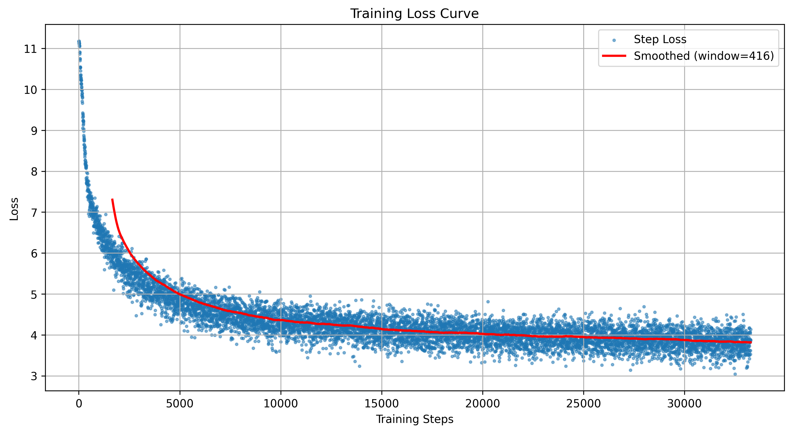
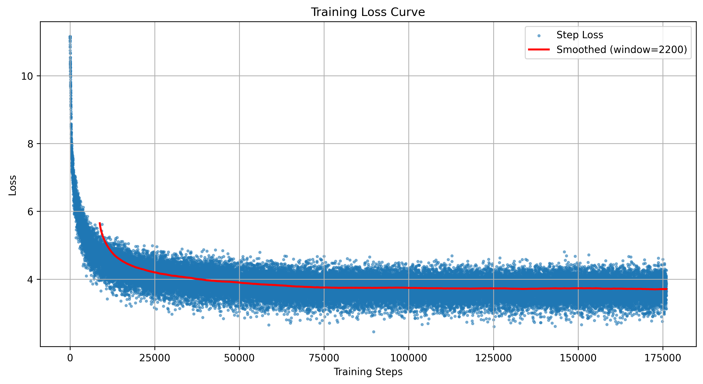
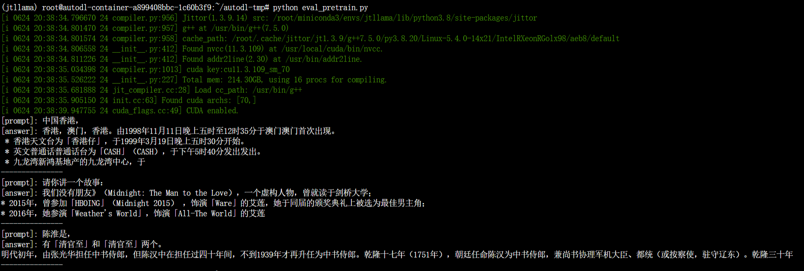
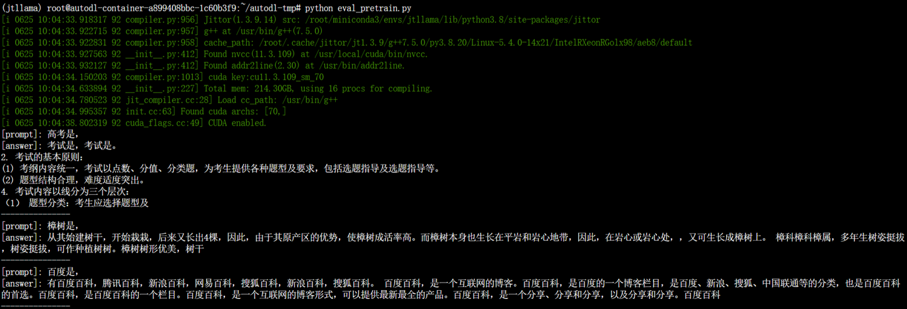

# 介绍
本项目旨在使用jittor框架复现Llama论文中的模型。

注：将环境配置、数据准备脚本、训练脚本、测试脚本、与pytorch实现对齐的实验log，性能log都放在README中。

注：参考了许多相关资料，详见主要参考部分。

注：llama1论文对应源码未开源，但他们主要结构基本一致，是上下文长度变化、数据集大小以及注意力机制不同，所以本项目代码是参照相关llama2代码改进的。

# 主要内容 
以下是主要内容目录：
```
# 关于jittor的安装
# llama_jittor复现
# 文件组织结构
# 主要参考
```

# jittor的安装
强烈建议在linux环境下安装，因为作者不信邪在windows上安装了一天都没弄好，ubuntu上没有任何阻碍
## 核心语句
```shell
conda create -n jtllama python=3.8
conda activate jtllama

sudo apt install python3.8-dev libomp-dev
python3.8 -m pip install jittor
python3.8 -m jittor.test.test_example
# 如果您电脑包含Nvidia显卡，检查cudnn加速库
python3.8 -m jittor.test.test_cudnn_op
```
如果是新手，第一次接触linux使用的是虚拟机或是租用的服务器，在运行出现错误时，大部分情况都是找不到packet，直接上网搜换源教程即可。

运行上述语句的最后两个测试通过，则说明jittor成功安装了

# llama_jittor复现
前期model.py各模块测试均运行在虚拟机，数据处理、模型训练在autoDL上租用服务器，单卡V100（32G），基础镜像为
- Jittor  1.3.1
- Python  3.8(ubuntu18.04)
- CUDA  11.3

## 环境配置   
```shell
    conda create -n jtllama python=3.8
    conda activate jtllama

    conda install --yes --file requirements.txt
```
关于环境配置的要点

* 仍有一些包没有写在requirement中：
    * 如jieba等，用pip安装
    * 安装scikit-learn
* 运行时，遇到包不存在，pip逐个导入即可

## 配置完成后'pip list'的输出
```
(jtllama) root@autodl-container-a899408bbc-1c60b3f9:~# pip list
Package                  Version
------------------------ -----------
astunparse               1.6.3
certifi                  2025.6.15
charset-normalizer       3.4.2
contourpy                1.1.1
cycler                   0.12.1
filelock                 3.16.1
fonttools                4.57.0
fsspec                   2025.3.0
hf-xet                   1.1.5
huggingface-hub          0.33.0
idna                     3.10
importlib_resources      6.4.5
Jinja2                   3.1.6
jittor                   1.3.9.14
joblib                   1.4.2
kiwisolver               1.4.7
MarkupSafe               2.1.5
matplotlib               3.7.5
mpmath                   1.3.0
networkx                 3.1
numpy                    1.24.4
nvidia-cublas-cu12       12.1.3.1
nvidia-cuda-cupti-cu12   12.1.105
nvidia-cuda-nvrtc-cu12   12.1.105
nvidia-cuda-runtime-cu12 12.1.105
nvidia-cudnn-cu12        9.1.0.70
nvidia-cufft-cu12        11.0.2.54
nvidia-curand-cu12       10.3.2.106
nvidia-cusolver-cu12     11.4.5.107
nvidia-cusparse-cu12     12.1.0.106
nvidia-nccl-cu12         2.20.5
nvidia-nvjitlink-cu12    12.9.86
nvidia-nvtx-cu12         12.1.105
packaging                25.0
pandas                   2.0.3
pillow                   10.4.0
pip                      24.2
psutil                   7.0.0
pyparsing                3.1.4
python-dateutil          2.9.0.post0
pytz                     2025.2
PyYAML                   6.0.2
regex                    2024.11.6
requests                 2.32.4
safetensors              0.5.3
scikit-learn             1.3.2
scipy                    1.10.1
sentencepiece            0.2.0
setuptools               75.1.0
six                      1.17.0
sympy                    1.13.3
threadpoolctl            3.5.0
tokenizers               0.20.3
torch                    2.4.1
tqdm                     4.67.1
transformers             4.46.3
triton                   3.0.0
typing_extensions        4.13.2
tzdata                   2025.2
urllib3                  2.2.3
wheel                    0.44.0
zipp                     3.20.2
```
## 数据准备脚本（data_process.py、clear.py）
数据来源：
* 中文维基百科 https://www.modelscope.cn/datasets/AI-ModelScope/wikipedia-cn-20230720-filtered/summary
* 563w_baidubaike https://www.modelscope.cn/datasets/fq980207/563w_baidubaike/files

在data_process.py中对应更改本地文件位置即可

进行了简单的数据清洗后，对数据进行训练前预处理，对语料进行提前分词，对一个样本做完分词后在末尾加上一个结束符号< eos >，与下一个样本区分开。

data_process.py:
```python
import json
import glob
import numpy as np
from tqdm import tqdm
from chatglm_tokenizer.tokenization_chatglm import ChatGLMTokenizer
import pandas as pd
def process_wiki_clean():
    with open('./data/wikipedia_cn_20230720/wikipedia-cn-20230720-filtered.json','r',encoding='utf-8') as f:
        data=json.load(f)
    doc_ids=[]
    for line in tqdm(data):
        text=line['completion']
        text_id=tokenizer.encode(text,add_special_tokens=False)
        text_id.append(tokenizer.special_tokens['<eos>'])
        if len(text_id)>5:
            doc_ids+=text_id
    arr = np.array(doc_ids,dtype=np.uint16)
    with open('./data/wiki.bin','wb') as f:
        f.write(arr.tobytes())


def process_baidu():
    BATCH_SIZE = 1000000

    cnt=0
    batch_cnt=0
    token=0
    doc_ids=[]

    f1=open('./data/563w_baidubaike/563w_baidubaike.json','r',encoding='utf-8')
    
    while True:
        line = f1.readline()
        if not line:
            break
        line=json.loads(line)
        text=''
        try:
            text+=line['title']+'：'+line['summary']
        except:
            pass
        for per in line['sections']:
            text+=per['title']+'：'+per['content']+'。'
        text_id=tokenizer.encode(text,add_special_tokens=False)
        text_id.append(tokenizer.special_tokens['<eos>'])
        if len(text_id)>5:
            doc_ids+=text_id
        cnt+=1
        if cnt%BATCH_SIZE==0:
            batch_cnt+=1
            arr = np.array(doc_ids,dtype=np.uint16)
            doc_ids=[]
            print('cnt:',cnt,'arr_shape:',arr.shape)
            with open('./data/baidubaike_563w_{}.bin'.format(batch_cnt),'wb') as f2:
                f2.write(arr.tobytes())
            del arr

    if not doc_ids:
        batch_cnt+=1
        arr = np.array(doc_ids,dtype=np.uint16)
        print('cnt:',cnt,'arr_shape:',arr.shape)
        with open('./data/baidubaike_563w_{}.bin'.format(batch_cnt),'wb') as f:
            f.write(arr.tobytes())

if __name__=="__main__":
    tokenizer = ChatGLMTokenizer(vocab_file='./chatglm_tokenizer/tokenizer.model')
    # 数据预处理
    process_wiki_clean()
    process_baidu()

    print('data processing finished!')

    # 分词处理后的文件列表
    data_path_list=[
        './data/baidubaike_563w_1.bin',
        './data/baidubaike_563w_2.bin',
        './data/baidubaike_563w_3.bin',
        './data/baidubaike_563w_4.bin',
        './data/baidubaike_563w_5.bin',
        './data/wiki.bin',
    ]
```

## 训练脚本（pretrain.py）
时间原因，训练的数据较少，仅训练了两份数据集，但是训练了两个模型：单独wiki.bin、以及wiki.bin和baidubaike_563w，他们的训练时间分别是1h和8h，训练参数相较于原论文有所减少。

```python
import os
import time
import math
import logging
import jittor as jt
from jittor import nn
from jittor import optim
from jittor.dataset import Dataset
import numpy as np
import matplotlib.pyplot as plt
import psutil

# 导入转换后的模型和数据集
from model import Transformer, ModelArgs
from data_set import PretrainDataset

# 初始化 Jittor
jt.flags.use_cuda = 1
jt.flags.log_silent = True  


def get_logger(filename, verbosity=1, name=None):
    level_dict = {0: logging.DEBUG, 1: logging.INFO, 2: logging.WARNING}
    formatter = logging.Formatter(
        "[%(asctime)s][%(filename)s][%(levelname)s] %(message)s"
    )
    logger = logging.getLogger(name)
    logger.setLevel(level_dict[verbosity])

    fh = logging.FileHandler(filename, "w")
    fh.setFormatter(formatter)
    logger.addHandler(fh)

    sh = logging.StreamHandler()
    sh.setFormatter(formatter)
    logger.addHandler(sh)
    return logger


def get_lr(it):
    if it < warmup_iters:
        return learning_rate * it / warmup_iters

    if it > lr_decay_iters:
        return min_lr

    decay_ratio = (it - warmup_iters) / (lr_decay_iters - warmup_iters)
    assert 0 <= decay_ratio <= 1
    coeff = 0.5 * (1.0 + math.cos(math.pi * decay_ratio))
    return min_lr + coeff * (learning_rate - min_lr)

def train_epoch(epoch):
    start_time = time.time()
    model.train()
    epoch_losses = []  # 存储当前epoch的loss值
    for step, (X, Y) in enumerate(train_loader):
        # 更新学习率
        current_iter = epoch * iter_per_epoch + step
        lr = get_lr(current_iter) if decay_lr else learning_rate
        optimizer.lr = lr

        # 前向传播和损失计算
        with jt.flag_scope(amp_level=amp_level):
            logits = model(X)
            loss = nn.cross_entropy_loss(
                logits.view(-1, logits.size(-1)),
                Y.view(-1),
                ignore_index=-1
            )
            loss = loss / gradient_accumulation_steps

        # 反向传播
        optimizer.backward(loss)

        # 梯度累积
        if (step + 1) % gradient_accumulation_steps == 0:
            # 梯度裁剪
            if grad_clip != 0.0:
                optimizer.clip_grad_norm(grad_clip, norm_type=2)

            # 更新参数
            optimizer.step()
            optimizer.zero_grad()
            
            # 记录损失值
            loss_value = loss.item() * gradient_accumulation_steps
            epoch_losses.append(loss_value)
            loss_records.append((current_iter, loss_value))

        # 打印日志
        if step % log_interval == 0:
            spend_time = time.time() - start_time
            avg_time = spend_time / (step + 1)
            eta = avg_time * (iter_per_epoch - step) / 60
            logger.info(
                'Epoch:[{}/{}]({}/{}) loss:{:.3f} lr:{:.7f} ETA:{:.1f}min'.format(
                    epoch, max_epoch, step, iter_per_epoch,
                    loss.item() * gradient_accumulation_steps, lr, eta))

        # 保存检查点
        if step % save_interval == 0:
            model_path = os.path.join(save_dir, f'iter_{current_iter}.pkl')
            model.save(model_path)
            logger.info(f'Saved model to {model_path}')

def init_model():
    # 模型配置
    model_args = ModelArgs(
        dim=dim,
        n_layers=n_layers,
        n_heads=n_heads,
        n_kv_heads=n_heads,
        vocab_size=vocab_size,
        multiple_of=multiple_of,
        max_seq_len=max_seq_len,
        dropout=dropout,
    )

    # 初始化模型
    if init_from == "scratch":
        logger.info("Initializing a new model from scratch")
        model = Transformer(model_args)
    elif init_from == "resume":
        logger.info(f"Resuming training from {out_dir}")
        model_path = os.path.join(out_dir, "ckpt.pkl")
        model = Transformer.load(model_path)

    return model

def plot_loss_curve(loss_records, save_dir):
    if not loss_records:
        logger.warning("No loss records to plot.")
        return
    
    steps, losses = zip(*loss_records)
    
    plt.figure(figsize=(12, 6))
    
    # 绘制原始loss点
    plt.scatter(steps, losses, s=5, alpha=0.5, label='Step Loss')
    
    # 计算并绘制滑动平均loss
    window_size = max(1, len(losses) // 20) 
    smoothed_losses = np.convolve(losses, np.ones(window_size)/window_size, mode='valid')
    plt.plot(steps[window_size-1:], smoothed_losses, 'r-', linewidth=2, label=f'Smoothed (window={window_size})')
    
    plt.title('Training Loss Curve')
    plt.xlabel('Training Steps')
    plt.ylabel('Loss')
    plt.legend()
    plt.grid(True)
    
    # 保存图像
    plot_path = os.path.join(save_dir, 'loss_curve_bigger.png')
    plt.savefig(plot_path, dpi=300, bbox_inches='tight')
    plt.close()
    
    logger.info(f"Loss curve saved to {plot_path}")

if __name__ == "__main__":
    # ================ 配置参数 ================
    out_dir = 'out'
    max_epoch = 1
    log_interval = 100
    save_interval = 10000
    init_from = 'scratch'
    gradient_accumulation_steps = 4
    batch_size = 16
    max_seq_len = 256
    dim = 512
    n_layers = 8
    n_heads = 8
    multiple_of = 32
    dropout = 0.0
    vocab_size = 64793 
    learning_rate = 3e-4
    weight_decay = 1e-1
    beta1 = 1
    beta2 = 2
    grad_clip = 1.0
    decay_lr = True
    warmup_iters = 1000
    lr_decay_iters = 80000
    min_lr = 1e-5
    amp_level = 2  

    # 创建输出目录
    save_dir = os.path.join(out_dir, 'pretrain')
    if not os.path.exists(save_dir):
        os.makedirs(save_dir)

    # 初始化日志
    logger = get_logger(os.path.join(save_dir, 'log.log'))

    # 记录配置参数
    config_params = {
        'out_dir': out_dir,
        'max_epoch': max_epoch,
        'log_interval': log_interval,
        'save_interval': save_interval,
        'init_from': init_from,
        'gradient_accumulation_steps': gradient_accumulation_steps,
        'batch_size': batch_size,
        'max_seq_len': max_seq_len,
        'dim': dim,
        'n_layers': n_layers,
        'n_heads': n_heads,
        'multiple_of': multiple_of,
        'dropout': dropout,
        'vocab_size': vocab_size,
        'learning_rate': learning_rate,
        'weight_decay': weight_decay,
        'beta1': beta1,
        'beta2': beta2,
        'grad_clip': grad_clip,
        'decay_lr': decay_lr,
        'warmup_iters': warmup_iters,
        'lr_decay_iters': lr_decay_iters,
        'min_lr': min_lr,
        'amp_level': amp_level,
    }

    logger.info("Training Configuration:")
    for key, value in config_params.items():
        logger.info(f"  {key}: {value}")

    # 设置混合精度
    if amp_level > 0:
        jt.flags.amp_level = amp_level

    # 初始化模型
    model = init_model()

    # 初始化优化器
    optimizer = model.configure_optimizers(weight_decay, learning_rate, (beta1,beta2))

    # 初始化数据集
    data_path_list = [
        './data/baidubaike_563w_1.bin',
        './data/baidubaike_563w_2.bin',
         './data/wiki.bin'
    ]
    train_ds = PretrainDataset(data_path_list, max_length=max_seq_len, memmap=True)

    # 初始化数据加载器
    train_loader = train_ds.set_attrs(
        batch_size=batch_size,
        shuffle=True,
        num_workers=4,
        drop_last=False,
    )

    # 计算迭代次数
    iter_per_epoch = len(train_loader)
    logger.info(f"Training dataset size: {len(train_ds)}")
    logger.info(f"Iterations per epoch: {iter_per_epoch}")
    logger.info(f"Total iterations: {iter_per_epoch * max_epoch}")
    
    loss_records = []  
    # 训练循环
    for epoch in range(max_epoch):
        logger.info(f"Starting epoch {epoch + 1}/{max_epoch}")
        train_epoch(epoch)

        # 保存最终模型
        model_path = os.path.join(save_dir, f'epoch_bigger{epoch}.pkl')
        model.save(model_path)
        logger.info(f'Saved final model to {model_path}')

    logger.info("Training completed!")
    #绘制loss曲线
    plot_loss_curve(loss_records, save_dir)
```

## 测试脚本（eval_pretrain.py）
```python
import os
import json
import jittor as jt
from model import ModelArgs, Transformer
from chatglm_tokenizer.tokenization_chatglm import ChatGLMTokenizer
import numpy as np

jt.flags.use_cuda = 1 
jt.flags.log_silent = True  

# 配置参数
out_dir = 'out'  
start = ""  
num_samples = 1 
max_new_tokens = 100  
temperature = 1.0  
top_k = 30  
seed = 1337 

# 模型参数配置
max_seq_len = 256
dim = 512
n_layers = 8
n_heads = 8
multiple_of = 32
dropout = 0.0 

model_args = dict(
    dim=dim,
    n_layers=n_layers,
    n_heads=n_heads,
    n_kv_heads=n_heads,
    vocab_size=64793,
    multiple_of=multiple_of,
    max_seq_len=max_seq_len,
    dropout=dropout,
)

# 设置随机种子
jt.set_global_seed(seed)

# 初始化模型
gptconf = ModelArgs(**model_args)
model = Transformer(gptconf)

# 加载模型权重
model_path = 'out/pretrain/epoch_bigger0.pkl'
model.load_parameters(jt.load(model_path))

# 设置为评估模式
model.eval()

# 加载tokenizer
tokenizer = ChatGLMTokenizer(vocab_file='./chatglm_tokenizer/tokenizer.model')

# 测试数据
data = [
    {"question": "高考是，"},
    {"question": "樟树是，"},
    {"question": "百度是，"},
]

# 生成文本
ans_lst = []
for p in data:
    prompt = p['question']
    x = tokenizer.encode(prompt, add_special_tokens=False)
    x = jt.array(x).int().unsqueeze(0) 
    
    with jt.no_grad():
        # 生成文本
        y = model.generate(x, 2, max_new_tokens, temperature=temperature, top_k=top_k)
        
        # 解码生成的文本
        generated_ids = y[0].numpy().tolist()
        answer = tokenizer.decode(generated_ids)
        answer = answer.replace(prompt, '')  # 移除原始提示
        
        ans_lst.append(answer)
        print('[prompt]:', prompt)
        print('[answer]:', answer)
        print('---------------')
```

## 实验log

### 训练log
训练数据较多，此处展示部分log
```
[2025-06-24 20:57:44,416][pretrain.py][INFO] Training Configuration:
[2025-06-24 20:57:44,417][pretrain.py][INFO]   out_dir: out
[2025-06-24 20:57:44,417][pretrain.py][INFO]   max_epoch: 1
[2025-06-24 20:57:44,417][pretrain.py][INFO]   log_interval: 100
[2025-06-24 20:57:44,417][pretrain.py][INFO]   save_interval: 10000
[2025-06-24 20:57:44,417][pretrain.py][INFO]   init_from: scratch
[2025-06-24 20:57:44,417][pretrain.py][INFO]   gradient_accumulation_steps: 4
[2025-06-24 20:57:44,417][pretrain.py][INFO]   batch_size: 16
[2025-06-24 20:57:44,417][pretrain.py][INFO]   max_seq_len: 256
[2025-06-24 20:57:44,417][pretrain.py][INFO]   dim: 512
[2025-06-24 20:57:44,417][pretrain.py][INFO]   n_layers: 8
[2025-06-24 20:57:44,417][pretrain.py][INFO]   n_heads: 8
[2025-06-24 20:57:44,417][pretrain.py][INFO]   multiple_of: 32
[2025-06-24 20:57:44,417][pretrain.py][INFO]   dropout: 0.0
[2025-06-24 20:57:44,417][pretrain.py][INFO]   vocab_size: 64793
[2025-06-24 20:57:44,417][pretrain.py][INFO]   learning_rate: 0.0003
[2025-06-24 20:57:44,418][pretrain.py][INFO]   weight_decay: 0.1
[2025-06-24 20:57:44,418][pretrain.py][INFO]   beta: 1
[2025-06-24 20:57:44,418][pretrain.py][INFO]   grad_clip: 1.0
[2025-06-24 20:57:44,418][pretrain.py][INFO]   decay_lr: True
[2025-06-24 20:57:44,418][pretrain.py][INFO]   warmup_iters: 1000
[2025-06-24 20:57:44,418][pretrain.py][INFO]   lr_decay_iters: 80000
[2025-06-24 20:57:44,418][pretrain.py][INFO]   min_lr: 1e-05
[2025-06-24 20:57:44,418][pretrain.py][INFO]   amp_level: 2
[2025-06-24 20:57:44,418][pretrain.py][INFO] Initializing a new model from scratch
[2025-06-24 20:57:44,433][pretrain.py][INFO] Training dataset size: 2816672
[2025-06-24 20:57:44,433][pretrain.py][INFO] Iterations per epoch: 2816672
[2025-06-24 20:57:44,433][pretrain.py][INFO] Total iterations: 2816672
[2025-06-24 20:57:44,433][pretrain.py][INFO] Starting epoch 1/1
[2025-06-24 20:57:47,602][pretrain.py][INFO] Epoch:[0/1](0/2816672) loss:11.168 lr:0.0000000 ETA:141590.9min
[2025-06-24 20:57:49,375][pretrain.py][INFO] Saved model to out/pretrain/iter_0.pkl
[2025-06-24 20:58:05,991][pretrain.py][INFO] Epoch:[0/1](100/2816672) loss:10.352 lr:0.0000300 ETA:9976.6min
[2025-06-24 20:58:22,301][pretrain.py][INFO] Epoch:[0/1](200/2816672) loss:9.684 lr:0.0000600 ETA:8822.1min
[2025-06-24 20:58:38,611][pretrain.py][INFO] Epoch:[0/1](300/2816672) loss:8.715 lr:0.0000900 ETA:8434.2min
[2025-06-24 20:58:54,878][pretrain.py][INFO] Epoch:[0/1](400/2816672) loss:7.976 lr:0.0001200 ETA:8234.9min
[2025-06-24 20:59:11,164][pretrain.py][INFO] Epoch:[0/1](500/2816672) loss:7.633 lr:0.0001500 ETA:8116.7min
[2025-06-24 20:59:27,489][pretrain.py][INFO] Epoch:[0/1](600/2816672) loss:7.238 lr:0.0001800 ETA:8040.8min
[2025-06-24 20:59:43,853][pretrain.py][INFO] Epoch:[0/1](700/2816672) loss:7.089 lr:0.0002100 ETA:7989.0min
[2025-06-24 21:00:00,199][pretrain.py][INFO] Epoch:[0/1](800/2816672) loss:7.095 lr:0.0002400 ETA:7949.2min
[2025-06-24 21:00:16,571][pretrain.py][INFO] Epoch:[0/1](900/2816672) loss:6.946 lr:0.0002700 ETA:7919.4min
[2025-06-24 21:00:32,942][pretrain.py][INFO] Epoch:[0/1](1000/2816672) loss:7.015 lr:0.0003000 ETA:7895.6min
[2025-06-24 21:00:49,316][pretrain.py][INFO] Epoch:[0/1](1100/2816672) loss:7.071 lr:0.0003000 ETA:7876.0min
[2025-06-24 21:01:05,677][pretrain.py][INFO] Epoch:[0/1](1200/2816672) loss:6.444 lr:0.0003000 ETA:7859.3min
[2025-06-24 21:01:22,061][pretrain.py][INFO] Epoch:[0/1](1300/2816672) loss:6.329 lr:0.0003000 ETA:7845.8min
[2025-06-24 21:01:38,442][pretrain.py][INFO] Epoch:[0/1](1400/2816672) loss:6.681 lr:0.0003000 ETA:7834.1min
[2025-06-24 21:01:54,838][pretrain.py][INFO] Epoch:[0/1](1500/2816672) loss:6.412 lr:0.0003000 ETA:7824.5min
[2025-06-24 21:02:11,216][pretrain.py][INFO] Epoch:[0/1](1600/2816672) loss:6.247 lr:0.0003000 ETA:7815.5min
[2025-06-24 21:02:27,572][pretrain.py][INFO] Epoch:[0/1](1700/2816672) loss:6.240 lr:0.0002999 ETA:7806.9min
[2025-06-24 21:02:43,881][pretrain.py][INFO] Epoch:[0/1](1800/2816672) loss:6.256 lr:0.0002999 ETA:7797.9min
[2025-06-24 21:03:00,194][pretrain.py][INFO] Epoch:[0/1](1900/2816672) loss:6.019 lr:0.0002999 ETA:7790.0min
[2025-06-24 21:03:16,480][pretrain.py][INFO] Epoch:[0/1](2000/2816672) loss:6.013 lr:0.0002999 ETA:7782.3min
[2025-06-24 21:03:32,762][pretrain.py][INFO] Epoch:[0/1](2100/2816672) loss:6.047 lr:0.0002999 ETA:7775.1min
[2025-06-24 21:03:49,032][pretrain.py][INFO] Epoch:[0/1](2200/2816672) loss:6.248 lr:0.0002998 ETA:7768.4min
[2025-06-24 21:04:05,334][pretrain.py][INFO] Epoch:[0/1](2300/2816672) loss:6.204 lr:0.0002998 ETA:7762.8min
[2025-06-24 21:04:21,621][pretrain.py][INFO] Epoch:[0/1](2400/2816672) loss:6.051 lr:0.0002998 ETA:7757.4min
[2025-06-24 21:04:37,910][pretrain.py][INFO] Epoch:[0/1](2500/2816672) loss:5.620 lr:0.0002997 ETA:7752.4min
[2025-06-24 21:04:54,241][pretrain.py][INFO] Epoch:[0/1](2600/2816672) loss:5.881 lr:0.0002997 ETA:7748.6min
[2025-06-24 21:05:10,544][pretrain.py][INFO] Epoch:[0/1](2700/2816672) loss:6.012 lr:0.0002997 ETA:7744.5min
[2025-06-24 21:05:26,893][pretrain.py][INFO] Epoch:[0/1](2800/2816672) loss:6.164 lr:0.0002996 ETA:7741.5min
[2025-06-24 21:05:43,214][pretrain.py][INFO] Epoch:[0/1](2900/2816672) loss:5.627 lr:0.0002996 ETA:7738.2min
[2025-06-24 21:05:59,522][pretrain.py][INFO] Epoch:[0/1](3000/2816672) loss:5.811 lr:0.0002995 ETA:7735.0min
[2025-06-24 21:06:15,815][pretrain.py][INFO] Epoch:[0/1](3100/2816672) loss:5.658 lr:0.0002995 ETA:7731.6min
[2025-06-24 21:06:32,102][pretrain.py][INFO] Epoch:[0/1](3200/2816672) loss:5.491 lr:0.0002994 ETA:7728.4min
[2025-06-24 21:06:48,358][pretrain.py][INFO] Epoch:[0/1](3300/2816672) loss:5.354 lr:0.0002994 ETA:7724.9min
[2025-06-24 21:07:04,639][pretrain.py][INFO] Epoch:[0/1](3400/2816672) loss:5.300 lr:0.0002993 ETA:7722.0min
[2025-06-24 21:07:20,957][pretrain.py][INFO] Epoch:[0/1](3500/2816672) loss:5.513 lr:0.0002993 ETA:7719.7min
[2025-06-24 21:07:37,293][pretrain.py][INFO] Epoch:[0/1](3600/2816672) loss:5.188 lr:0.0002992 ETA:7717.7min
[2025-06-24 21:07:53,593][pretrain.py][INFO] Epoch:[0/1](3700/2816672) loss:5.279 lr:0.0002992 ETA:7715.4min
[2025-06-24 21:08:09,921][pretrain.py][INFO] Epoch:[0/1](3800/2816672) loss:5.812 lr:0.0002991 ETA:7713.6min
[2025-06-24 21:08:26,215][pretrain.py][INFO] Epoch:[0/1](3900/2816672) loss:5.516 lr:0.0002990 ETA:7711.4min
[2025-06-24 21:08:42,529][pretrain.py][INFO] Epoch:[0/1](4000/2816672) loss:4.742 lr:0.0002990 ETA:7709.5min
[2025-06-24 21:08:58,845][pretrain.py][INFO] Epoch:[0/1](4100/2816672) loss:5.151 lr:0.0002989 ETA:7707.8min
[2025-06-24 21:09:15,118][pretrain.py][INFO] Epoch:[0/1](4200/2816672) loss:5.827 lr:0.0002988 ETA:7705.6min
[2025-06-24 21:09:31,423][pretrain.py][INFO] Epoch:[0/1](4300/2816672) loss:5.343 lr:0.0002988 ETA:7703.9min
[2025-06-24 21:09:47,716][pretrain.py][INFO] Epoch:[0/1](4400/2816672) loss:5.732 lr:0.0002987 ETA:7702.1min
[2025-06-24 21:10:04,016][pretrain.py][INFO] Epoch:[0/1](4500/2816672) loss:5.122 lr:0.0002986 ETA:7700.4min
[2025-06-24 21:10:20,320][pretrain.py][INFO] Epoch:[0/1](4600/2816672) loss:5.148 lr:0.0002985 ETA:7698.9min
[2025-06-24 21:10:36,633][pretrain.py][INFO] Epoch:[0/1](4700/2816672) loss:5.278 lr:0.0002984 ETA:7697.4min
[2025-06-24 21:10:52,967][pretrain.py][INFO] Epoch:[0/1](4800/2816672) loss:4.490 lr:0.0002983 ETA:7696.3min
[2025-06-24 21:11:09,292][pretrain.py][INFO] Epoch:[0/1](4900/2816672) loss:5.322 lr:0.0002983 ETA:7695.1min
[2025-06-24 21:11:25,588][pretrain.py][INFO] Epoch:[0/1](5000/2816672) loss:5.415 lr:0.0002982 ETA:7693.6min
[2025-06-24 21:11:41,890][pretrain.py][INFO] Epoch:[0/1](5100/2816672) loss:4.988 lr:0.0002981 ETA:7692.3min
[2025-06-24 21:11:58,204][pretrain.py][INFO] Epoch:[0/1](5200/2816672) loss:5.544 lr:0.0002980 ETA:7691.1min
[2025-06-24 21:12:14,487][pretrain.py][INFO] Epoch:[0/1](5300/2816672) loss:5.329 lr:0.0002979 ETA:7689.7min
[2025-06-24 21:12:30,792][pretrain.py][INFO] Epoch:[0/1](5400/2816672) loss:4.968 lr:0.0002978 ETA:7688.5min
[2025-06-24 21:12:47,089][pretrain.py][INFO] Epoch:[0/1](5500/2816672) loss:5.153 lr:0.0002977 ETA:7687.3min
[2025-06-24 21:13:03,363][pretrain.py][INFO] Epoch:[0/1](5600/2816672) loss:5.320 lr:0.0002976 ETA:7685.9min
[2025-06-24 21:13:19,679][pretrain.py][INFO] Epoch:[0/1](5700/2816672) loss:5.284 lr:0.0002975 ETA:7684.9min
[2025-06-24 21:13:35,996][pretrain.py][INFO] Epoch:[0/1](5800/2816672) loss:4.755 lr:0.0002974 ETA:7683.9min
[2025-06-24 21:13:52,304][pretrain.py][INFO] Epoch:[0/1](5900/2816672) loss:5.165 lr:0.0002973 ETA:7682.9min
[2025-06-24 21:14:08,628][pretrain.py][INFO] Epoch:[0/1](6000/2816672) loss:5.333 lr:0.0002971 ETA:7682.0min
[2025-06-24 21:14:24,987][pretrain.py][INFO] Epoch:[0/1](6100/2816672) loss:5.432 lr:0.0002970 ETA:7681.5min
[2025-06-24 21:14:41,329][pretrain.py][INFO] Epoch:[0/1](6200/2816672) loss:4.975 lr:0.0002969 ETA:7680.7min
[2025-06-24 21:14:57,685][pretrain.py][INFO] Epoch:[0/1](6300/2816672) loss:4.272 lr:0.0002968 ETA:7680.2min
[2025-06-24 21:15:14,019][pretrain.py][INFO] Epoch:[0/1](6400/2816672) loss:4.889 lr:0.0002967 ETA:7679.4min
[2025-06-24 21:15:30,359][pretrain.py][INFO] Epoch:[0/1](6500/2816672) loss:4.744 lr:0.0002965 ETA:7678.8min
[2025-06-24 21:15:46,683][pretrain.py][INFO] Epoch:[0/1](6600/2816672) loss:4.445 lr:0.0002964 ETA:7678.0min
[2025-06-24 21:16:02,986][pretrain.py][INFO] Epoch:[0/1](6700/2816672) loss:3.966 lr:0.0002963 ETA:7677.1min
[2025-06-24 21:16:19,287][pretrain.py][INFO] Epoch:[0/1](6800/2816672) loss:4.329 lr:0.0002962 ETA:7676.2min
[2025-06-24 21:16:35,606][pretrain.py][INFO] Epoch:[0/1](6900/2816672) loss:4.582 lr:0.0002960 ETA:7675.4min
[2025-06-24 21:16:51,914][pretrain.py][INFO] Epoch:[0/1](7000/2816672) loss:4.335 lr:0.0002959 ETA:7674.6min
[2025-06-24 21:17:08,234][pretrain.py][INFO] Epoch:[0/1](7100/2816672) loss:4.723 lr:0.0002958 ETA:7673.9min
[2025-06-24 21:17:24,600][pretrain.py][INFO] Epoch:[0/1](7200/2816672) loss:5.310 lr:0.0002956 ETA:7673.4min
[2025-06-24 21:17:40,909][pretrain.py][INFO] Epoch:[0/1](7300/2816672) loss:4.079 lr:0.0002955 ETA:7672.7min
[2025-06-24 21:17:57,411][pretrain.py][INFO] Epoch:[0/1](7400/2816672) loss:5.222 lr:0.0002953 ETA:7673.1min
[2025-06-24 21:18:13,961][pretrain.py][INFO] Epoch:[0/1](7500/2816672) loss:4.830 lr:0.0002952 ETA:7673.9min
[2025-06-24 21:18:30,307][pretrain.py][INFO] Epoch:[0/1](7600/2816672) loss:4.934 lr:0.0002950 ETA:7673.3min
[2025-06-24 21:18:46,643][pretrain.py][INFO] Epoch:[0/1](7700/2816672) loss:4.414 lr:0.0002949 ETA:7672.7min
[2025-06-24 21:19:03,062][pretrain.py][INFO] Epoch:[0/1](7800/2816672) loss:4.771 lr:0.0002947 ETA:7672.6min
[2025-06-24 21:19:19,407][pretrain.py][INFO] Epoch:[0/1](7900/2816672) loss:4.521 lr:0.0002946 ETA:7672.1min
[2025-06-24 21:19:35,748][pretrain.py][INFO] Epoch:[0/1](8000/2816672) loss:4.575 lr:0.0002944 ETA:7671.5min
[2025-06-24 21:19:52,131][pretrain.py][INFO] Epoch:[0/1](8100/2816672) loss:4.624 lr:0.0002943 ETA:7671.2min
[2025-06-24 21:20:08,509][pretrain.py][INFO] Epoch:[0/1](8200/2816672) loss:3.806 lr:0.0002941 ETA:7670.9min
[2025-06-24 21:20:24,929][pretrain.py][INFO] Epoch:[0/1](8300/2816672) loss:5.206 lr:0.0002939 ETA:7670.8min
[2025-06-24 21:20:41,328][pretrain.py][INFO] Epoch:[0/1](8400/2816672) loss:4.821 lr:0.0002938 ETA:7670.6min
[2025-06-24 21:20:57,723][pretrain.py][INFO] Epoch:[0/1](8500/2816672) loss:4.531 lr:0.0002936 ETA:7670.3min
[2025-06-24 21:21:14,078][pretrain.py][INFO] Epoch:[0/1](8600/2816672) loss:4.538 lr:0.0002934 ETA:7669.9min
[2025-06-24 21:21:30,460][pretrain.py][INFO] Epoch:[0/1](8700/2816672) loss:4.641 lr:0.0002933 ETA:7669.6min
[2025-06-24 21:21:46,871][pretrain.py][INFO] Epoch:[0/1](8800/2816672) loss:4.676 lr:0.0002931 ETA:7669.4min
[2025-06-24 21:22:03,281][pretrain.py][INFO] Epoch:[0/1](8900/2816672) loss:4.799 lr:0.0002929 ETA:7669.3min
[2025-06-24 21:22:19,659][pretrain.py][INFO] Epoch:[0/1](9000/2816672) loss:5.179 lr:0.0002927 ETA:7668.9min
[2025-06-24 21:22:36,005][pretrain.py][INFO] Epoch:[0/1](9100/2816672) loss:4.827 lr:0.0002925 ETA:7668.4min
[2025-06-24 21:22:52,345][pretrain.py][INFO] Epoch:[0/1](9200/2816672) loss:4.616 lr:0.0002924 ETA:7667.9min
[2025-06-24 21:23:08,727][pretrain.py][INFO] Epoch:[0/1](9300/2816672) loss:4.769 lr:0.0002922 ETA:7667.6min
[2025-06-24 21:23:25,161][pretrain.py][INFO] Epoch:[0/1](9400/2816672) loss:4.937 lr:0.0002920 ETA:7667.6min
[2025-06-24 21:23:41,579][pretrain.py][INFO] Epoch:[0/1](9500/2816672) loss:4.987 lr:0.0002918 ETA:7667.5min
[2025-06-24 21:23:58,003][pretrain.py][INFO] Epoch:[0/1](9600/2816672) loss:4.709 lr:0.0002916 ETA:7667.4min
[2025-06-24 21:24:14,331][pretrain.py][INFO] Epoch:[0/1](9700/2816672) loss:4.663 lr:0.0002914 ETA:7666.8min
[2025-06-24 21:24:30,657][pretrain.py][INFO] Epoch:[0/1](9800/2816672) loss:4.552 lr:0.0002912 ETA:7666.2min
[2025-06-24 21:24:47,014][pretrain.py][INFO] Epoch:[0/1](9900/2816672) loss:4.505 lr:0.0002910 ETA:7665.8min
[2025-06-24 21:25:03,330][pretrain.py][INFO] Epoch:[0/1](10000/2816672) loss:4.770 lr:0.0002908 ETA:7665.2min
[2025-06-24 21:25:05,158][pretrain.py][INFO] Saved model to out/pretrain/iter_10000.pkl
[2025-06-24 21:25:21,507][pretrain.py][INFO] Epoch:[0/1](10100/2816672) loss:4.358 lr:0.0002906 ETA:7673.2min
[2025-06-24 21:25:37,821][pretrain.py][INFO] Epoch:[0/1](10200/2816672) loss:4.525 lr:0.0002904 ETA:7672.5min
[2025-06-24 21:25:54,133][pretrain.py][INFO] Epoch:[0/1](10300/2816672) loss:4.406 lr:0.0002902 ETA:7671.9min
[2025-06-24 21:26:10,458][pretrain.py][INFO] Epoch:[0/1](10400/2816672) loss:4.684 lr:0.0002900 ETA:7671.2min
[2025-06-24 21:26:26,790][pretrain.py][INFO] Epoch:[0/1](10500/2816672) loss:4.379 lr:0.0002898 ETA:7670.6min
[2025-06-24 21:26:43,100][pretrain.py][INFO] Epoch:[0/1](10600/2816672) loss:4.477 lr:0.0002896 ETA:7670.0min
[2025-06-24 21:26:59,414][pretrain.py][INFO] Epoch:[0/1](10700/2816672) loss:4.413 lr:0.0002893 ETA:7669.3min
[2025-06-24 21:27:15,712][pretrain.py][INFO] Epoch:[0/1](10800/2816672) loss:4.941 lr:0.0002891 ETA:7668.6min
[2025-06-24 21:27:32,015][pretrain.py][INFO] Epoch:[0/1](10900/2816672) loss:4.409 lr:0.0002889 ETA:7667.9min
[2025-06-24 21:27:48,292][pretrain.py][INFO] Epoch:[0/1](11000/2816672) loss:4.634 lr:0.0002887 ETA:7667.1min
[2025-06-24 21:28:04,591][pretrain.py][INFO] Epoch:[0/1](11100/2816672) loss:3.935 lr:0.0002885 ETA:7666.5min
[2025-06-24 21:28:20,925][pretrain.py][INFO] Epoch:[0/1](11200/2816672) loss:4.034 lr:0.0002882 ETA:7665.9min
[2025-06-24 21:28:37,253][pretrain.py][INFO] Epoch:[0/1](11300/2816672) loss:4.591 lr:0.0002880 ETA:7665.4min
[2025-06-24 21:28:53,553][pretrain.py][INFO] Epoch:[0/1](11400/2816672) loss:4.020 lr:0.0002878 ETA:7664.7min
[2025-06-24 21:29:09,861][pretrain.py][INFO] Epoch:[0/1](11500/2816672) loss:4.703 lr:0.0002875 ETA:7664.1min
[2025-06-24 21:29:26,219][pretrain.py][INFO] Epoch:[0/1](11600/2816672) loss:4.089 lr:0.0002873 ETA:7663.7min
[2025-06-24 21:29:42,556][pretrain.py][INFO] Epoch:[0/1](11700/2816672) loss:4.592 lr:0.0002871 ETA:7663.2min
[2025-06-24 21:29:58,880][pretrain.py][INFO] Epoch:[0/1](11800/2816672) loss:4.816 lr:0.0002868 ETA:7662.6min
[2025-06-24 21:30:15,196][pretrain.py][INFO] Epoch:[0/1](11900/2816672) loss:4.268 lr:0.0002866 ETA:7662.1min
[2025-06-24 21:30:31,555][pretrain.py][INFO] Epoch:[0/1](12000/2816672) loss:4.479 lr:0.0002863 ETA:7661.7min
[2025-06-24 21:30:47,888][pretrain.py][INFO] Epoch:[0/1](12100/2816672) loss:4.860 lr:0.0002861 ETA:7661.2min
[2025-06-24 21:31:04,241][pretrain.py][INFO] Epoch:[0/1](12200/2816672) loss:3.804 lr:0.0002859 ETA:7660.8min
[2025-06-24 21:31:20,582][pretrain.py][INFO] Epoch:[0/1](12300/2816672) loss:4.497 lr:0.0002856 ETA:7660.3min
[2025-06-24 21:31:36,936][pretrain.py][INFO] Epoch:[0/1](12400/2816672) loss:4.331 lr:0.0002854 ETA:7659.9min
[2025-06-24 21:31:53,292][pretrain.py][INFO] Epoch:[0/1](12500/2816672) loss:4.754 lr:0.0002851 ETA:7659.5min
[2025-06-24 21:32:09,600][pretrain.py][INFO] Epoch:[0/1](12600/2816672) loss:3.620 lr:0.0002848 ETA:7658.9min
[2025-06-24 21:32:25,930][pretrain.py][INFO] Epoch:[0/1](12700/2816672) loss:4.436 lr:0.0002846 ETA:7658.4min
[2025-06-24 21:32:42,252][pretrain.py][INFO] Epoch:[0/1](12800/2816672) loss:5.026 lr:0.0002843 ETA:7657.9min
[2025-06-24 21:32:58,602][pretrain.py][INFO] Epoch:[0/1](12900/2816672) loss:4.537 lr:0.0002841 ETA:7657.5min
[2025-06-24 21:33:14,924][pretrain.py][INFO] Epoch:[0/1](13000/2816672) loss:4.577 lr:0.0002838 ETA:7657.0min
[2025-06-24 21:33:31,243][pretrain.py][INFO] Epoch:[0/1](13100/2816672) loss:4.516 lr:0.0002835 ETA:7656.5min
[2025-06-24 21:33:47,576][pretrain.py][INFO] Epoch:[0/1](13200/2816672) loss:4.250 lr:0.0002833 ETA:7656.1min
[2025-06-24 21:34:03,893][pretrain.py][INFO] Epoch:[0/1](13300/2816672) loss:4.129 lr:0.0002830 ETA:7655.5min
[2025-06-24 21:34:20,236][pretrain.py][INFO] Epoch:[0/1](13400/2816672) loss:4.351 lr:0.0002827 ETA:7655.1min
[2025-06-24 21:34:36,559][pretrain.py][INFO] Epoch:[0/1](13500/2816672) loss:4.350 lr:0.0002825 ETA:7654.6min
[2025-06-24 21:34:52,866][pretrain.py][INFO] Epoch:[0/1](13600/2816672) loss:4.455 lr:0.0002822 ETA:7654.1min
[2025-06-24 21:35:09,233][pretrain.py][INFO] Epoch:[0/1](13700/2816672) loss:4.847 lr:0.0002819 ETA:7653.8min
[2025-06-24 21:35:25,564][pretrain.py][INFO] Epoch:[0/1](13800/2816672) loss:4.415 lr:0.0002816 ETA:7653.3min
[2025-06-24 21:35:41,901][pretrain.py][INFO] Epoch:[0/1](13900/2816672) loss:4.312 lr:0.0002813 ETA:7652.9min
[2025-06-24 21:35:58,241][pretrain.py][INFO] Epoch:[0/1](14000/2816672) loss:4.708 lr:0.0002811 ETA:7652.5min
[2025-06-24 21:36:14,572][pretrain.py][INFO] Epoch:[0/1](14100/2816672) loss:4.114 lr:0.0002808 ETA:7652.0min
[2025-06-24 21:36:30,893][pretrain.py][INFO] Epoch:[0/1](14200/2816672) loss:4.531 lr:0.0002805 ETA:7651.5min
[2025-06-24 21:36:47,231][pretrain.py][INFO] Epoch:[0/1](14300/2816672) loss:4.440 lr:0.0002802 ETA:7651.1min
[2025-06-24 21:37:03,545][pretrain.py][INFO] Epoch:[0/1](14400/2816672) loss:4.520 lr:0.0002799 ETA:7650.6min
[2025-06-24 21:37:19,868][pretrain.py][INFO] Epoch:[0/1](14500/2816672) loss:4.311 lr:0.0002796 ETA:7650.2min
[2025-06-24 21:37:36,224][pretrain.py][INFO] Epoch:[0/1](14600/2816672) loss:4.754 lr:0.0002793 ETA:7649.8min
[2025-06-24 21:37:52,568][pretrain.py][INFO] Epoch:[0/1](14700/2816672) loss:4.345 lr:0.0002790 ETA:7649.4min
[2025-06-24 21:38:08,952][pretrain.py][INFO] Epoch:[0/1](14800/2816672) loss:4.396 lr:0.0002787 ETA:7649.2min
[2025-06-24 21:38:25,310][pretrain.py][INFO] Epoch:[0/1](14900/2816672) loss:4.000 lr:0.0002784 ETA:7648.8min
[2025-06-24 21:38:41,670][pretrain.py][INFO] Epoch:[0/1](15000/2816672) loss:4.161 lr:0.0002781 ETA:7648.5min
[2025-06-24 21:38:58,048][pretrain.py][INFO] Epoch:[0/1](15100/2816672) loss:4.644 lr:0.0002778 ETA:7648.2min
[2025-06-24 21:39:14,565][pretrain.py][INFO] Epoch:[0/1](15200/2816672) loss:3.749 lr:0.0002775 ETA:7648.4min
[2025-06-24 21:39:30,901][pretrain.py][INFO] Epoch:[0/1](15300/2816672) loss:4.540 lr:0.0002772 ETA:7648.0min
[2025-06-24 21:39:47,204][pretrain.py][INFO] Epoch:[0/1](15400/2816672) loss:4.458 lr:0.0002769 ETA:7647.5min
[2025-06-24 21:40:03,520][pretrain.py][INFO] Epoch:[0/1](15500/2816672) loss:4.531 lr:0.0002766 ETA:7647.0min
[2025-06-24 21:40:19,833][pretrain.py][INFO] Epoch:[0/1](15600/2816672) loss:4.316 lr:0.0002762 ETA:7646.5min
[2025-06-24 21:40:36,133][pretrain.py][INFO] Epoch:[0/1](15700/2816672) loss:4.644 lr:0.0002759 ETA:7646.0min
[2025-06-24 21:40:52,428][pretrain.py][INFO] Epoch:[0/1](15800/2816672) loss:4.252 lr:0.0002756 ETA:7645.5min
[2025-06-24 21:41:08,746][pretrain.py][INFO] Epoch:[0/1](15900/2816672) loss:4.539 lr:0.0002753 ETA:7645.0min
[2025-06-24 21:41:25,061][pretrain.py][INFO] Epoch:[0/1](16000/2816672) loss:4.096 lr:0.0002750 ETA:7644.6min
[2025-06-24 21:41:41,343][pretrain.py][INFO] Epoch:[0/1](16100/2816672) loss:4.743 lr:0.0002746 ETA:7644.0min
[2025-06-24 21:41:57,653][pretrain.py][INFO] Epoch:[0/1](16200/2816672) loss:4.413 lr:0.0002743 ETA:7643.6min
[2025-06-24 21:42:14,002][pretrain.py][INFO] Epoch:[0/1](16300/2816672) loss:3.607 lr:0.0002740 ETA:7643.2min
[2025-06-24 21:42:30,347][pretrain.py][INFO] Epoch:[0/1](16400/2816672) loss:4.697 lr:0.0002736 ETA:7642.9min
[2025-06-24 21:42:46,677][pretrain.py][INFO] Epoch:[0/1](16500/2816672) loss:4.499 lr:0.0002733 ETA:7642.5min
[2025-06-24 21:43:02,976][pretrain.py][INFO] Epoch:[0/1](16600/2816672) loss:4.340 lr:0.0002730 ETA:7642.0min
[2025-06-24 21:43:19,240][pretrain.py][INFO] Epoch:[0/1](16700/2816672) loss:4.667 lr:0.0002726 ETA:7641.4min
[2025-06-24 21:43:35,490][pretrain.py][INFO] Epoch:[0/1](16800/2816672) loss:3.741 lr:0.0002723 ETA:7640.8min
[2025-06-24 21:43:51,746][pretrain.py][INFO] Epoch:[0/1](16900/2816672) loss:4.379 lr:0.0002720 ETA:7640.2min
[2025-06-24 21:44:08,006][pretrain.py][INFO] Epoch:[0/1](17000/2816672) loss:4.229 lr:0.0002716 ETA:7639.6min
[2025-06-24 21:44:24,247][pretrain.py][INFO] Epoch:[0/1](17100/2816672) loss:3.809 lr:0.0002713 ETA:7638.9min
[2025-06-24 21:44:40,504][pretrain.py][INFO] Epoch:[0/1](17200/2816672) loss:4.619 lr:0.0002709 ETA:7638.4min
[2025-06-24 21:44:56,722][pretrain.py][INFO] Epoch:[0/1](17300/2816672) loss:3.702 lr:0.0002706 ETA:7637.7min
[2025-06-24 21:45:12,964][pretrain.py][INFO] Epoch:[0/1](17400/2816672) loss:4.759 lr:0.0002702 ETA:7637.1min
[2025-06-24 21:45:29,199][pretrain.py][INFO] Epoch:[0/1](17500/2816672) loss:4.010 lr:0.0002699 ETA:7636.4min
[2025-06-24 21:45:45,478][pretrain.py][INFO] Epoch:[0/1](17600/2816672) loss:4.738 lr:0.0002695 ETA:7635.9min
[2025-06-24 21:46:01,729][pretrain.py][INFO] Epoch:[0/1](17700/2816672) loss:4.273 lr:0.0002692 ETA:7635.3min
[2025-06-24 21:46:17,966][pretrain.py][INFO] Epoch:[0/1](17800/2816672) loss:3.946 lr:0.0002688 ETA:7634.7min
[2025-06-24 21:46:34,236][pretrain.py][INFO] Epoch:[0/1](17900/2816672) loss:4.004 lr:0.0002685 ETA:7634.2min
[2025-06-24 21:46:50,484][pretrain.py][INFO] Epoch:[0/1](18000/2816672) loss:4.458 lr:0.0002681 ETA:7633.6min
[2025-06-24 21:47:06,726][pretrain.py][INFO] Epoch:[0/1](18100/2816672) loss:4.385 lr:0.0002677 ETA:7633.0min
[2025-06-24 21:47:22,965][pretrain.py][INFO] Epoch:[0/1](18200/2816672) loss:4.459 lr:0.0002674 ETA:7632.4min
[2025-06-24 21:47:39,164][pretrain.py][INFO] Epoch:[0/1](18300/2816672) loss:4.379 lr:0.0002670 ETA:7631.7min
[2025-06-24 21:47:55,363][pretrain.py][INFO] Epoch:[0/1](18400/2816672) loss:4.201 lr:0.0002667 ETA:7631.1min
[2025-06-24 21:48:11,574][pretrain.py][INFO] Epoch:[0/1](18500/2816672) loss:3.992 lr:0.0002663 ETA:7630.4min
[2025-06-24 21:48:27,815][pretrain.py][INFO] Epoch:[0/1](18600/2816672) loss:3.989 lr:0.0002659 ETA:7629.8min
[2025-06-24 21:48:44,057][pretrain.py][INFO] Epoch:[0/1](18700/2816672) loss:4.489 lr:0.0002655 ETA:7629.3min
[2025-06-24 21:49:00,290][pretrain.py][INFO] Epoch:[0/1](18800/2816672) loss:4.212 lr:0.0002652 ETA:7628.7min
[2025-06-24 21:49:16,506][pretrain.py][INFO] Epoch:[0/1](18900/2816672) loss:3.999 lr:0.0002648 ETA:7628.0min
[2025-06-24 21:49:32,749][pretrain.py][INFO] Epoch:[0/1](19000/2816672) loss:3.855 lr:0.0002644 ETA:7627.5min
[2025-06-24 21:49:48,999][pretrain.py][INFO] Epoch:[0/1](19100/2816672) loss:4.567 lr:0.0002640 ETA:7626.9min
[2025-06-24 21:50:05,298][pretrain.py][INFO] Epoch:[0/1](19200/2816672) loss:4.991 lr:0.0002637 ETA:7626.5min
[2025-06-24 21:50:21,594][pretrain.py][INFO] Epoch:[0/1](19300/2816672) loss:3.845 lr:0.0002633 ETA:7626.1min
[2025-06-24 21:50:37,892][pretrain.py][INFO] Epoch:[0/1](19400/2816672) loss:3.951 lr:0.0002629 ETA:7625.7min
[2025-06-24 21:50:54,176][pretrain.py][INFO] Epoch:[0/1](19500/2816672) loss:4.114 lr:0.0002625 ETA:7625.3min
[2025-06-24 21:51:10,438][pretrain.py][INFO] Epoch:[0/1](19600/2816672) loss:4.530 lr:0.0002621 ETA:7624.8min
[2025-06-24 21:51:26,691][pretrain.py][INFO] Epoch:[0/1](19700/2816672) loss:3.928 lr:0.0002617 ETA:7624.2min
[2025-06-24 21:51:42,982][pretrain.py][INFO] Epoch:[0/1](19800/2816672) loss:3.735 lr:0.0002613 ETA:7623.8min
[2025-06-24 21:51:59,260][pretrain.py][INFO] Epoch:[0/1](19900/2816672) loss:3.347 lr:0.0002609 ETA:7623.4min
[2025-06-24 21:52:15,558][pretrain.py][INFO] Epoch:[0/1](20000/2816672) loss:4.096 lr:0.0002605 ETA:7623.0min
[2025-06-24 21:52:17,239][pretrain.py][INFO] Saved model to out/pretrain/iter_20000.pkl
[2025-06-24 21:52:33,516][pretrain.py][INFO] Epoch:[0/1](20100/2816672) loss:3.670 lr:0.0002601 ETA:7626.4min
[2025-06-24 21:52:49,761][pretrain.py][INFO] Epoch:[0/1](20200/2816672) loss:4.363 lr:0.0002597 ETA:7625.9min
[2025-06-24 21:53:06,014][pretrain.py][INFO] Epoch:[0/1](20300/2816672) loss:3.708 lr:0.0002593 ETA:7625.3min
[2025-06-24 21:53:22,262][pretrain.py][INFO] Epoch:[0/1](20400/2816672) loss:3.884 lr:0.0002589 ETA:7624.8min
[2025-06-24 21:53:38,523][pretrain.py][INFO] Epoch:[0/1](20500/2816672) loss:4.119 lr:0.0002585 ETA:7624.3min
[2025-06-24 21:53:54,782][pretrain.py][INFO] Epoch:[0/1](20600/2816672) loss:4.226 lr:0.0002581 ETA:7623.8min
[2025-06-24 21:54:11,040][pretrain.py][INFO] Epoch:[0/1](20700/2816672) loss:3.914 lr:0.0002577 ETA:7623.3min
[2025-06-24 21:54:27,296][pretrain.py][INFO] Epoch:[0/1](20800/2816672) loss:4.383 lr:0.0002573 ETA:7622.8min
[2025-06-24 21:54:43,539][pretrain.py][INFO] Epoch:[0/1](20900/2816672) loss:4.108 lr:0.0002569 ETA:7622.3min
[2025-06-24 21:54:59,784][pretrain.py][INFO] Epoch:[0/1](21000/2816672) loss:4.261 lr:0.0002565 ETA:7621.7min
[2025-06-24 21:55:16,057][pretrain.py][INFO] Epoch:[0/1](21100/2816672) loss:4.554 lr:0.0002561 ETA:7621.3min
[2025-06-24 21:55:32,314][pretrain.py][INFO] Epoch:[0/1](21200/2816672) loss:4.531 lr:0.0002557 ETA:7620.8min
[2025-06-24 21:55:48,574][pretrain.py][INFO] Epoch:[0/1](21300/2816672) loss:4.221 lr:0.0002553 ETA:7620.3min
[2025-06-24 21:56:04,843][pretrain.py][INFO] Epoch:[0/1](21400/2816672) loss:4.123 lr:0.0002548 ETA:7619.8min
[2025-06-24 21:56:21,135][pretrain.py][INFO] Epoch:[0/1](21500/2816672) loss:3.876 lr:0.0002544 ETA:7619.4min
[2025-06-24 21:56:37,388][pretrain.py][INFO] Epoch:[0/1](21600/2816672) loss:4.543 lr:0.0002540 ETA:7618.9min
[2025-06-24 21:56:53,652][pretrain.py][INFO] Epoch:[0/1](21700/2816672) loss:4.460 lr:0.0002536 ETA:7618.5min
[2025-06-24 21:57:09,904][pretrain.py][INFO] Epoch:[0/1](21800/2816672) loss:4.450 lr:0.0002532 ETA:7618.0min
[2025-06-24 21:57:26,150][pretrain.py][INFO] Epoch:[0/1](21900/2816672) loss:4.421 lr:0.0002527 ETA:7617.5min
[2025-06-24 21:57:42,411][pretrain.py][INFO] Epoch:[0/1](22000/2816672) loss:3.842 lr:0.0002523 ETA:7617.0min
[2025-06-24 21:57:58,665][pretrain.py][INFO] Epoch:[0/1](22100/2816672) loss:4.435 lr:0.0002519 ETA:7616.5min
[2025-06-24 21:58:14,956][pretrain.py][INFO] Epoch:[0/1](22200/2816672) loss:4.559 lr:0.0002515 ETA:7616.1min
[2025-06-24 21:58:31,222][pretrain.py][INFO] Epoch:[0/1](22300/2816672) loss:4.217 lr:0.0002510 ETA:7615.7min
[2025-06-24 21:58:47,482][pretrain.py][INFO] Epoch:[0/1](22400/2816672) loss:4.303 lr:0.0002506 ETA:7615.2min
[2025-06-24 21:59:03,737][pretrain.py][INFO] Epoch:[0/1](22500/2816672) loss:4.641 lr:0.0002502 ETA:7614.7min
[2025-06-24 21:59:19,995][pretrain.py][INFO] Epoch:[0/1](22600/2816672) loss:3.856 lr:0.0002497 ETA:7614.3min
[2025-06-24 21:59:36,266][pretrain.py][INFO] Epoch:[0/1](22700/2816672) loss:4.158 lr:0.0002493 ETA:7613.8min
[2025-06-24 21:59:52,528][pretrain.py][INFO] Epoch:[0/1](22800/2816672) loss:4.392 lr:0.0002488 ETA:7613.4min
[2025-06-24 22:00:08,958][pretrain.py][INFO] Epoch:[0/1](22900/2816672) loss:4.479 lr:0.0002484 ETA:7613.3min
[2025-06-24 22:00:25,250][pretrain.py][INFO] Epoch:[0/1](23000/2816672) loss:4.102 lr:0.0002480 ETA:7612.9min
[2025-06-24 22:00:41,612][pretrain.py][INFO] Epoch:[0/1](23100/2816672) loss:4.051 lr:0.0002475 ETA:7612.6min
[2025-06-24 22:00:57,961][pretrain.py][INFO] Epoch:[0/1](23200/2816672) loss:4.407 lr:0.0002471 ETA:7612.4min
[2025-06-24 22:01:14,295][pretrain.py][INFO] Epoch:[0/1](23300/2816672) loss:4.096 lr:0.0002466 ETA:7612.0min
[2025-06-24 22:01:30,592][pretrain.py][INFO] Epoch:[0/1](23400/2816672) loss:4.181 lr:0.0002462 ETA:7611.7min
[2025-06-24 22:01:46,872][pretrain.py][INFO] Epoch:[0/1](23500/2816672) loss:4.425 lr:0.0002457 ETA:7611.3min
[2025-06-24 22:02:03,122][pretrain.py][INFO] Epoch:[0/1](23600/2816672) loss:3.903 lr:0.0002453 ETA:7610.8min
[2025-06-24 22:02:19,370][pretrain.py][INFO] Epoch:[0/1](23700/2816672) loss:3.914 lr:0.0002448 ETA:7610.3min
[2025-06-24 22:02:35,598][pretrain.py][INFO] Epoch:[0/1](23800/2816672) loss:3.624 lr:0.0002444 ETA:7609.8min
[2025-06-24 22:02:51,830][pretrain.py][INFO] Epoch:[0/1](23900/2816672) loss:3.872 lr:0.0002439 ETA:7609.3min
[2025-06-24 22:03:08,149][pretrain.py][INFO] Epoch:[0/1](24000/2816672) loss:4.415 lr:0.0002435 ETA:7609.0min
[2025-06-24 22:03:24,475][pretrain.py][INFO] Epoch:[0/1](24100/2816672) loss:4.273 lr:0.0002430 ETA:7608.7min
[2025-06-24 22:03:40,771][pretrain.py][INFO] Epoch:[0/1](24200/2816672) loss:3.817 lr:0.0002425 ETA:7608.3min
[2025-06-24 22:03:57,124][pretrain.py][INFO] Epoch:[0/1](24300/2816672) loss:3.940 lr:0.0002421 ETA:7608.0min
[2025-06-24 22:04:13,497][pretrain.py][INFO] Epoch:[0/1](24400/2816672) loss:4.066 lr:0.0002416 ETA:7607.8min
[2025-06-24 22:04:29,804][pretrain.py][INFO] Epoch:[0/1](24500/2816672) loss:4.313 lr:0.0002412 ETA:7607.5min
[2025-06-24 22:04:46,091][pretrain.py][INFO] Epoch:[0/1](24600/2816672) loss:4.093 lr:0.0002407 ETA:7607.1min
[2025-06-24 22:05:02,465][pretrain.py][INFO] Epoch:[0/1](24700/2816672) loss:3.785 lr:0.0002402 ETA:7606.9min
[2025-06-24 22:05:18,755][pretrain.py][INFO] Epoch:[0/1](24800/2816672) loss:4.193 lr:0.0002398 ETA:7606.5min
[2025-06-24 22:05:35,039][pretrain.py][INFO] Epoch:[0/1](24900/2816672) loss:4.004 lr:0.0002393 ETA:7606.1min
[2025-06-24 22:05:51,282][pretrain.py][INFO] Epoch:[0/1](25000/2816672) loss:4.011 lr:0.0002388 ETA:7605.6min
[2025-06-24 22:06:07,580][pretrain.py][INFO] Epoch:[0/1](25100/2816672) loss:3.913 lr:0.0002384 ETA:7605.3min
[2025-06-24 22:06:23,874][pretrain.py][INFO] Epoch:[0/1](25200/2816672) loss:3.734 lr:0.0002379 ETA:7604.9min
[2025-06-24 22:06:40,136][pretrain.py][INFO] Epoch:[0/1](25300/2816672) loss:4.258 lr:0.0002374 ETA:7604.5min
[2025-06-24 22:06:56,412][pretrain.py][INFO] Epoch:[0/1](25400/2816672) loss:3.621 lr:0.0002369 ETA:7604.1min
[2025-06-24 22:07:12,654][pretrain.py][INFO] Epoch:[0/1](25500/2816672) loss:4.311 lr:0.0002365 ETA:7603.6min
[2025-06-24 22:07:28,915][pretrain.py][INFO] Epoch:[0/1](25600/2816672) loss:4.248 lr:0.0002360 ETA:7603.2min
[2025-06-24 22:07:45,167][pretrain.py][INFO] Epoch:[0/1](25700/2816672) loss:4.685 lr:0.0002355 ETA:7602.7min
[2025-06-24 22:08:01,460][pretrain.py][INFO] Epoch:[0/1](25800/2816672) loss:3.894 lr:0.0002350 ETA:7602.4min
[2025-06-24 22:08:17,785][pretrain.py][INFO] Epoch:[0/1](25900/2816672) loss:4.347 lr:0.0002345 ETA:7602.1min
[2025-06-24 22:08:34,084][pretrain.py][INFO] Epoch:[0/1](26000/2816672) loss:4.254 lr:0.0002341 ETA:7601.7min
[2025-06-24 22:08:50,430][pretrain.py][INFO] Epoch:[0/1](26100/2816672) loss:4.104 lr:0.0002336 ETA:7601.4min
[2025-06-24 22:09:06,781][pretrain.py][INFO] Epoch:[0/1](26200/2816672) loss:3.433 lr:0.0002331 ETA:7601.2min
[2025-06-24 22:09:23,064][pretrain.py][INFO] Epoch:[0/1](26300/2816672) loss:4.749 lr:0.0002326 ETA:7600.8min
[2025-06-24 22:09:39,310][pretrain.py][INFO] Epoch:[0/1](26400/2816672) loss:3.596 lr:0.0002321 ETA:7600.4min
[2025-06-24 22:09:55,550][pretrain.py][INFO] Epoch:[0/1](26500/2816672) loss:3.908 lr:0.0002316 ETA:7599.9min
[2025-06-24 22:10:11,831][pretrain.py][INFO] Epoch:[0/1](26600/2816672) loss:4.610 lr:0.0002311 ETA:7599.5min
[2025-06-24 22:10:28,046][pretrain.py][INFO] Epoch:[0/1](26700/2816672) loss:4.310 lr:0.0002306 ETA:7599.0min
[2025-06-24 22:10:44,239][pretrain.py][INFO] Epoch:[0/1](26800/2816672) loss:4.694 lr:0.0002301 ETA:7598.5min
[2025-06-24 22:11:00,437][pretrain.py][INFO] Epoch:[0/1](26900/2816672) loss:3.918 lr:0.0002297 ETA:7598.0min
[2025-06-24 22:11:16,651][pretrain.py][INFO] Epoch:[0/1](27000/2816672) loss:4.353 lr:0.0002292 ETA:7597.5min
[2025-06-24 22:11:32,862][pretrain.py][INFO] Epoch:[0/1](27100/2816672) loss:4.201 lr:0.0002287 ETA:7597.0min
[2025-06-24 22:11:49,082][pretrain.py][INFO] Epoch:[0/1](27200/2816672) loss:3.964 lr:0.0002282 ETA:7596.5min
[2025-06-24 22:12:05,311][pretrain.py][INFO] Epoch:[0/1](27300/2816672) loss:3.778 lr:0.0002277 ETA:7596.1min
[2025-06-24 22:12:21,527][pretrain.py][INFO] Epoch:[0/1](27400/2816672) loss:4.397 lr:0.0002272 ETA:7595.6min
[2025-06-24 22:12:37,768][pretrain.py][INFO] Epoch:[0/1](27500/2816672) loss:4.362 lr:0.0002267 ETA:7595.1min
[2025-06-24 22:12:53,981][pretrain.py][INFO] Epoch:[0/1](27600/2816672) loss:4.251 lr:0.0002262 ETA:7594.6min
[2025-06-24 22:13:10,188][pretrain.py][INFO] Epoch:[0/1](27700/2816672) loss:3.783 lr:0.0002257 ETA:7594.2min
[2025-06-24 22:13:26,390][pretrain.py][INFO] Epoch:[0/1](27800/2816672) loss:4.488 lr:0.0002252 ETA:7593.7min
[2025-06-24 22:13:42,560][pretrain.py][INFO] Epoch:[0/1](27900/2816672) loss:3.874 lr:0.0002247 ETA:7593.1min
[2025-06-24 22:13:58,770][pretrain.py][INFO] Epoch:[0/1](28000/2816672) loss:3.944 lr:0.0002241 ETA:7592.6min
[2025-06-24 22:14:14,973][pretrain.py][INFO] Epoch:[0/1](28100/2816672) loss:4.136 lr:0.0002236 ETA:7592.1min
[2025-06-24 22:14:31,184][pretrain.py][INFO] Epoch:[0/1](28200/2816672) loss:4.286 lr:0.0002231 ETA:7591.7min
[2025-06-24 22:14:47,402][pretrain.py][INFO] Epoch:[0/1](28300/2816672) loss:4.299 lr:0.0002226 ETA:7591.2min
[2025-06-24 22:15:03,599][pretrain.py][INFO] Epoch:[0/1](28400/2816672) loss:4.258 lr:0.0002221 ETA:7590.7min
[2025-06-24 22:15:19,789][pretrain.py][INFO] Epoch:[0/1](28500/2816672) loss:4.501 lr:0.0002216 ETA:7590.2min
[2025-06-24 22:15:35,987][pretrain.py][INFO] Epoch:[0/1](28600/2816672) loss:4.569 lr:0.0002211 ETA:7589.7min
[2025-06-24 22:15:52,205][pretrain.py][INFO] Epoch:[0/1](28700/2816672) loss:4.037 lr:0.0002206 ETA:7589.2min
[2025-06-24 22:16:08,416][pretrain.py][INFO] Epoch:[0/1](28800/2816672) loss:4.065 lr:0.0002201 ETA:7588.8min
[2025-06-24 22:16:24,640][pretrain.py][INFO] Epoch:[0/1](28900/2816672) loss:3.699 lr:0.0002195 ETA:7588.3min
[2025-06-24 22:16:40,853][pretrain.py][INFO] Epoch:[0/1](29000/2816672) loss:4.653 lr:0.0002190 ETA:7587.9min
[2025-06-24 22:16:57,068][pretrain.py][INFO] Epoch:[0/1](29100/2816672) loss:3.638 lr:0.0002185 ETA:7587.4min
[2025-06-24 22:17:13,283][pretrain.py][INFO] Epoch:[0/1](29200/2816672) loss:4.394 lr:0.0002180 ETA:7586.9min
[2025-06-24 22:17:29,494][pretrain.py][INFO] Epoch:[0/1](29300/2816672) loss:4.125 lr:0.0002175 ETA:7586.5min
[2025-06-24 22:17:45,718][pretrain.py][INFO] Epoch:[0/1](29400/2816672) loss:4.023 lr:0.0002169 ETA:7586.0min
[2025-06-24 22:18:01,952][pretrain.py][INFO] Epoch:[0/1](29500/2816672) loss:4.295 lr:0.0002164 ETA:7585.6min
[2025-06-24 22:18:18,155][pretrain.py][INFO] Epoch:[0/1](29600/2816672) loss:3.652 lr:0.0002159 ETA:7585.1min
[2025-06-24 22:18:34,393][pretrain.py][INFO] Epoch:[0/1](29700/2816672) loss:4.280 lr:0.0002154 ETA:7584.7min
[2025-06-24 22:18:50,626][pretrain.py][INFO] Epoch:[0/1](29800/2816672) loss:4.030 lr:0.0002149 ETA:7584.3min
[2025-06-24 22:19:06,849][pretrain.py][INFO] Epoch:[0/1](29900/2816672) loss:3.952 lr:0.0002143 ETA:7583.9min
[2025-06-24 22:19:23,067][pretrain.py][INFO] Epoch:[0/1](30000/2816672) loss:3.976 lr:0.0002138 ETA:7583.4min
[2025-06-24 22:19:24,737][pretrain.py][INFO] Saved model to out/pretrain/iter_30000.pkl
[2025-06-24 22:19:40,981][pretrain.py][INFO] Epoch:[0/1](30100/2816672) loss:4.131 lr:0.0002133 ETA:7585.6min
[2025-06-24 22:19:57,167][pretrain.py][INFO] Epoch:[0/1](30200/2816672) loss:4.331 lr:0.0002127 ETA:7585.1min
[2025-06-24 22:20:13,374][pretrain.py][INFO] Epoch:[0/1](30300/2816672) loss:4.113 lr:0.0002122 ETA:7584.6min
[2025-06-24 22:20:29,791][pretrain.py][INFO] Epoch:[0/1](30400/2816672) loss:3.899 lr:0.0002117 ETA:7584.5min
[2025-06-24 22:20:46,021][pretrain.py][INFO] Epoch:[0/1](30500/2816672) loss:3.892 lr:0.0002112 ETA:7584.1min
[2025-06-24 22:21:02,265][pretrain.py][INFO] Epoch:[0/1](30600/2816672) loss:3.657 lr:0.0002106 ETA:7583.7min
[2025-06-24 22:21:18,418][pretrain.py][INFO] Epoch:[0/1](30700/2816672) loss:4.309 lr:0.0002101 ETA:7583.1min
[2025-06-24 22:21:34,594][pretrain.py][INFO] Epoch:[0/1](30800/2816672) loss:4.423 lr:0.0002096 ETA:7582.6min
[2025-06-24 22:21:50,782][pretrain.py][INFO] Epoch:[0/1](30900/2816672) loss:4.186 lr:0.0002090 ETA:7582.1min
[2025-06-24 22:22:07,103][pretrain.py][INFO] Epoch:[0/1](31000/2816672) loss:4.062 lr:0.0002085 ETA:7581.8min
[2025-06-24 22:22:23,344][pretrain.py][INFO] Epoch:[0/1](31100/2816672) loss:3.990 lr:0.0002079 ETA:7581.4min
[2025-06-24 22:22:39,548][pretrain.py][INFO] Epoch:[0/1](31200/2816672) loss:3.859 lr:0.0002074 ETA:7581.0min
[2025-06-24 22:22:55,722][pretrain.py][INFO] Epoch:[0/1](31300/2816672) loss:3.919 lr:0.0002069 ETA:7580.5min
[2025-06-24 22:23:11,922][pretrain.py][INFO] Epoch:[0/1](31400/2816672) loss:4.134 lr:0.0002063 ETA:7580.0min
[2025-06-24 22:23:28,124][pretrain.py][INFO] Epoch:[0/1](31500/2816672) loss:4.049 lr:0.0002058 ETA:7579.5min
[2025-06-24 22:23:44,297][pretrain.py][INFO] Epoch:[0/1](31600/2816672) loss:4.062 lr:0.0002053 ETA:7579.0min
[2025-06-24 22:24:00,520][pretrain.py][INFO] Epoch:[0/1](31700/2816672) loss:3.509 lr:0.0002047 ETA:7578.6min
[2025-06-24 22:24:16,740][pretrain.py][INFO] Epoch:[0/1](31800/2816672) loss:4.011 lr:0.0002042 ETA:7578.2min
[2025-06-24 22:24:32,916][pretrain.py][INFO] Epoch:[0/1](31900/2816672) loss:4.336 lr:0.0002036 ETA:7577.7min
[2025-06-24 22:24:49,167][pretrain.py][INFO] Epoch:[0/1](32000/2816672) loss:3.564 lr:0.0002031 ETA:7577.3min
[2025-06-24 22:25:05,378][pretrain.py][INFO] Epoch:[0/1](32100/2816672) loss:4.294 lr:0.0002025 ETA:7576.9min
[2025-06-24 22:25:21,572][pretrain.py][INFO] Epoch:[0/1](32200/2816672) loss:4.218 lr:0.0002020 ETA:7576.4min
[2025-06-24 22:25:37,738][pretrain.py][INFO] Epoch:[0/1](32300/2816672) loss:4.076 lr:0.0002014 ETA:7575.9min
[2025-06-24 22:25:53,914][pretrain.py][INFO] Epoch:[0/1](32400/2816672) loss:3.757 lr:0.0002009 ETA:7575.4min
[2025-06-24 22:26:10,070][pretrain.py][INFO] Epoch:[0/1](32500/2816672) loss:4.317 lr:0.0002004 ETA:7574.9min
[2025-06-24 22:26:26,236][pretrain.py][INFO] Epoch:[0/1](32600/2816672) loss:4.427 lr:0.0001998 ETA:7574.4min
[2025-06-24 22:26:42,416][pretrain.py][INFO] Epoch:[0/1](32700/2816672) loss:3.931 lr:0.0001993 ETA:7573.9min
[2025-06-24 22:26:58,610][pretrain.py][INFO] Epoch:[0/1](32800/2816672) loss:3.531 lr:0.0001987 ETA:7573.5min
[2025-06-24 22:27:14,805][pretrain.py][INFO] Epoch:[0/1](32900/2816672) loss:4.069 lr:0.0001982 ETA:7573.0min
[2025-06-24 22:27:30,965][pretrain.py][INFO] Epoch:[0/1](33000/2816672) loss:4.046 lr:0.0001976 ETA:7572.5min
[2025-06-24 22:27:47,153][pretrain.py][INFO] Epoch:[0/1](33100/2816672) loss:4.648 lr:0.0001971 ETA:7572.1min
[2025-06-24 22:28:03,349][pretrain.py][INFO] Epoch:[0/1](33200/2816672) loss:4.027 lr:0.0001965 ETA:7571.6min
[2025-06-24 22:28:19,534][pretrain.py][INFO] Epoch:[0/1](33300/2816672) loss:3.326 lr:0.0001960 ETA:7571.2min
[2025-06-24 22:28:35,714][pretrain.py][INFO] Epoch:[0/1](33400/2816672) loss:4.008 lr:0.0001954 ETA:7570.7min
[2025-06-24 22:28:51,905][pretrain.py][INFO] Epoch:[0/1](33500/2816672) loss:4.454 lr:0.0001948 ETA:7570.2min
[2025-06-24 22:29:08,101][pretrain.py][INFO] Epoch:[0/1](33600/2816672) loss:3.831 lr:0.0001943 ETA:7569.8min
[2025-06-24 22:29:24,321][pretrain.py][INFO] Epoch:[0/1](33700/2816672) loss:4.146 lr:0.0001937 ETA:7569.4min
[2025-06-24 22:29:40,525][pretrain.py][INFO] Epoch:[0/1](33800/2816672) loss:3.678 lr:0.0001932 ETA:7569.0min
[2025-06-24 22:29:56,725][pretrain.py][INFO] Epoch:[0/1](33900/2816672) loss:4.080 lr:0.0001926 ETA:7568.5min
[2025-06-24 22:30:12,928][pretrain.py][INFO] Epoch:[0/1](34000/2816672) loss:4.110 lr:0.0001921 ETA:7568.1min
[2025-06-24 22:30:29,177][pretrain.py][INFO] Epoch:[0/1](34100/2816672) loss:3.847 lr:0.0001915 ETA:7567.7min
[2025-06-24 22:30:45,376][pretrain.py][INFO] Epoch:[0/1](34200/2816672) loss:4.413 lr:0.0001909 ETA:7567.3min
[2025-06-24 22:31:01,589][pretrain.py][INFO] Epoch:[0/1](34300/2816672) loss:4.091 lr:0.0001904 ETA:7566.9min
[2025-06-24 22:31:17,801][pretrain.py][INFO] Epoch:[0/1](34400/2816672) loss:3.821 lr:0.0001898 ETA:7566.5min
[2025-06-24 22:31:34,022][pretrain.py][INFO] Epoch:[0/1](34500/2816672) loss:3.750 lr:0.0001893 ETA:7566.1min
[2025-06-24 22:31:50,254][pretrain.py][INFO] Epoch:[0/1](34600/2816672) loss:4.463 lr:0.0001887 ETA:7565.7min
[2025-06-24 22:32:06,445][pretrain.py][INFO] Epoch:[0/1](34700/2816672) loss:3.693 lr:0.0001881 ETA:7565.2min
[2025-06-24 22:32:22,640][pretrain.py][INFO] Epoch:[0/1](34800/2816672) loss:3.955 lr:0.0001876 ETA:7564.8min
[2025-06-24 22:32:38,832][pretrain.py][INFO] Epoch:[0/1](34900/2816672) loss:3.971 lr:0.0001870 ETA:7564.4min
[2025-06-24 22:32:55,037][pretrain.py][INFO] Epoch:[0/1](35000/2816672) loss:3.487 lr:0.0001865 ETA:7564.0min
[2025-06-24 22:33:11,253][pretrain.py][INFO] Epoch:[0/1](35100/2816672) loss:3.965 lr:0.0001859 ETA:7563.6min
[2025-06-24 22:33:27,471][pretrain.py][INFO] Epoch:[0/1](35200/2816672) loss:3.835 lr:0.0001853 ETA:7563.2min
[2025-06-24 22:33:43,658][pretrain.py][INFO] Epoch:[0/1](35300/2816672) loss:4.282 lr:0.0001848 ETA:7562.7min
[2025-06-24 22:33:59,839][pretrain.py][INFO] Epoch:[0/1](35400/2816672) loss:3.877 lr:0.0001842 ETA:7562.3min
[2025-06-24 22:34:16,047][pretrain.py][INFO] Epoch:[0/1](35500/2816672) loss:3.959 lr:0.0001836 ETA:7561.9min
[2025-06-24 22:34:32,240][pretrain.py][INFO] Epoch:[0/1](35600/2816672) loss:4.176 lr:0.0001831 ETA:7561.4min
[2025-06-24 22:34:48,441][pretrain.py][INFO] Epoch:[0/1](35700/2816672) loss:4.123 lr:0.0001825 ETA:7561.0min
[2025-06-24 22:35:04,643][pretrain.py][INFO] Epoch:[0/1](35800/2816672) loss:3.874 lr:0.0001819 ETA:7560.6min
[2025-06-24 22:35:20,838][pretrain.py][INFO] Epoch:[0/1](35900/2816672) loss:3.647 lr:0.0001814 ETA:7560.2min
[2025-06-24 22:35:37,043][pretrain.py][INFO] Epoch:[0/1](36000/2816672) loss:4.528 lr:0.0001808 ETA:7559.8min
[2025-06-24 22:35:53,246][pretrain.py][INFO] Epoch:[0/1](36100/2816672) loss:3.843 lr:0.0001802 ETA:7559.4min
[2025-06-24 22:36:09,460][pretrain.py][INFO] Epoch:[0/1](36200/2816672) loss:3.807 lr:0.0001797 ETA:7559.0min
[2025-06-24 22:36:25,673][pretrain.py][INFO] Epoch:[0/1](36300/2816672) loss:3.684 lr:0.0001791 ETA:7558.6min
[2025-06-24 22:36:41,896][pretrain.py][INFO] Epoch:[0/1](36400/2816672) loss:3.818 lr:0.0001785 ETA:7558.2min
[2025-06-24 22:36:58,121][pretrain.py][INFO] Epoch:[0/1](36500/2816672) loss:3.329 lr:0.0001780 ETA:7557.8min
[2025-06-24 22:37:14,394][pretrain.py][INFO] Epoch:[0/1](36600/2816672) loss:4.000 lr:0.0001774 ETA:7557.5min
[2025-06-24 22:37:30,643][pretrain.py][INFO] Epoch:[0/1](36700/2816672) loss:4.210 lr:0.0001768 ETA:7557.1min
[2025-06-24 22:37:46,882][pretrain.py][INFO] Epoch:[0/1](36800/2816672) loss:4.057 lr:0.0001763 ETA:7556.8min
[2025-06-24 22:38:03,158][pretrain.py][INFO] Epoch:[0/1](36900/2816672) loss:4.107 lr:0.0001757 ETA:7556.4min
[2025-06-24 22:38:19,356][pretrain.py][INFO] Epoch:[0/1](37000/2816672) loss:3.570 lr:0.0001751 ETA:7556.0min
[2025-06-24 22:38:35,539][pretrain.py][INFO] Epoch:[0/1](37100/2816672) loss:4.508 lr:0.0001745 ETA:7555.6min
[2025-06-24 22:38:51,731][pretrain.py][INFO] Epoch:[0/1](37200/2816672) loss:4.064 lr:0.0001740 ETA:7555.2min
[2025-06-24 22:39:07,919][pretrain.py][INFO] Epoch:[0/1](37300/2816672) loss:3.091 lr:0.0001734 ETA:7554.8min
[2025-06-24 22:39:24,126][pretrain.py][INFO] Epoch:[0/1](37400/2816672) loss:3.438 lr:0.0001728 ETA:7554.4min
[2025-06-24 22:39:40,328][pretrain.py][INFO] Epoch:[0/1](37500/2816672) loss:4.288 lr:0.0001723 ETA:7554.0min
[2025-06-24 22:39:56,503][pretrain.py][INFO] Epoch:[0/1](37600/2816672) loss:4.238 lr:0.0001717 ETA:7553.5min
[2025-06-24 22:40:12,699][pretrain.py][INFO] Epoch:[0/1](37700/2816672) loss:3.747 lr:0.0001711 ETA:7553.1min
[2025-06-24 22:40:29,084][pretrain.py][INFO] Epoch:[0/1](37800/2816672) loss:4.165 lr:0.0001705 ETA:7552.9min
[2025-06-24 22:40:45,253][pretrain.py][INFO] Epoch:[0/1](37900/2816672) loss:3.988 lr:0.0001700 ETA:7552.5min
[2025-06-24 22:41:01,425][pretrain.py][INFO] Epoch:[0/1](38000/2816672) loss:3.374 lr:0.0001694 ETA:7552.1min
[2025-06-24 22:41:17,613][pretrain.py][INFO] Epoch:[0/1](38100/2816672) loss:4.386 lr:0.0001688 ETA:7551.6min
[2025-06-24 22:41:33,773][pretrain.py][INFO] Epoch:[0/1](38200/2816672) loss:3.862 lr:0.0001682 ETA:7551.2min
[2025-06-24 22:41:49,974][pretrain.py][INFO] Epoch:[0/1](38300/2816672) loss:3.741 lr:0.0001677 ETA:7550.8min
[2025-06-24 22:42:06,146][pretrain.py][INFO] Epoch:[0/1](38400/2816672) loss:3.732 lr:0.0001671 ETA:7550.4min
[2025-06-24 22:42:22,344][pretrain.py][INFO] Epoch:[0/1](38500/2816672) loss:3.476 lr:0.0001665 ETA:7550.0min
[2025-06-24 22:42:38,542][pretrain.py][INFO] Epoch:[0/1](38600/2816672) loss:3.831 lr:0.0001659 ETA:7549.6min
[2025-06-24 22:42:54,706][pretrain.py][INFO] Epoch:[0/1](38700/2816672) loss:4.384 lr:0.0001654 ETA:7549.1min
[2025-06-24 22:43:10,860][pretrain.py][INFO] Epoch:[0/1](38800/2816672) loss:4.127 lr:0.0001648 ETA:7548.7min
[2025-06-24 22:43:27,060][pretrain.py][INFO] Epoch:[0/1](38900/2816672) loss:3.897 lr:0.0001642 ETA:7548.3min
[2025-06-24 22:43:43,270][pretrain.py][INFO] Epoch:[0/1](39000/2816672) loss:3.869 lr:0.0001636 ETA:7547.9min
[2025-06-24 22:43:59,451][pretrain.py][INFO] Epoch:[0/1](39100/2816672) loss:4.041 lr:0.0001631 ETA:7547.5min
[2025-06-24 22:44:15,643][pretrain.py][INFO] Epoch:[0/1](39200/2816672) loss:4.013 lr:0.0001625 ETA:7547.1min
[2025-06-24 22:44:31,821][pretrain.py][INFO] Epoch:[0/1](39300/2816672) loss:4.282 lr:0.0001619 ETA:7546.6min
[2025-06-24 22:44:48,017][pretrain.py][INFO] Epoch:[0/1](39400/2816672) loss:4.038 lr:0.0001613 ETA:7546.2min
[2025-06-24 22:45:04,259][pretrain.py][INFO] Epoch:[0/1](39500/2816672) loss:3.836 lr:0.0001608 ETA:7545.9min
[2025-06-24 22:45:20,560][pretrain.py][INFO] Epoch:[0/1](39600/2816672) loss:3.312 lr:0.0001602 ETA:7545.6min
[2025-06-24 22:45:36,856][pretrain.py][INFO] Epoch:[0/1](39700/2816672) loss:3.745 lr:0.0001596 ETA:7545.4min
[2025-06-24 22:45:53,162][pretrain.py][INFO] Epoch:[0/1](39800/2816672) loss:4.240 lr:0.0001590 ETA:7545.1min
[2025-06-24 22:46:09,469][pretrain.py][INFO] Epoch:[0/1](39900/2816672) loss:3.592 lr:0.0001585 ETA:7544.8min
[2025-06-24 22:46:25,791][pretrain.py][INFO] Epoch:[0/1](40000/2816672) loss:4.068 lr:0.0001579 ETA:7544.6min
[2025-06-24 22:46:27,215][pretrain.py][INFO] Saved model to out/pretrain/iter_40000.pkl
[2025-06-24 22:46:43,560][pretrain.py][INFO] Epoch:[0/1](40100/2816672) loss:3.928 lr:0.0001573 ETA:7546.0min
[2025-06-24 22:46:59,911][pretrain.py][INFO] Epoch:[0/1](40200/2816672) loss:3.855 lr:0.0001567 ETA:7545.8min
[2025-06-24 22:47:16,238][pretrain.py][INFO] Epoch:[0/1](40300/2816672) loss:4.162 lr:0.0001562 ETA:7545.5min
[2025-06-24 22:47:32,548][pretrain.py][INFO] Epoch:[0/1](40400/2816672) loss:3.697 lr:0.0001556 ETA:7545.2min
[2025-06-24 22:47:48,854][pretrain.py][INFO] Epoch:[0/1](40500/2816672) loss:4.023 lr:0.0001550 ETA:7545.0min
[2025-06-24 22:48:05,221][pretrain.py][INFO] Epoch:[0/1](40600/2816672) loss:3.530 lr:0.0001544 ETA:7544.8min
[2025-06-24 22:48:21,554][pretrain.py][INFO] Epoch:[0/1](40700/2816672) loss:3.479 lr:0.0001538 ETA:7544.5min
[2025-06-24 22:48:37,849][pretrain.py][INFO] Epoch:[0/1](40800/2816672) loss:4.105 lr:0.0001533 ETA:7544.2min
[2025-06-24 22:48:54,156][pretrain.py][INFO] Epoch:[0/1](40900/2816672) loss:4.339 lr:0.0001527 ETA:7544.0min
[2025-06-24 22:49:10,395][pretrain.py][INFO] Epoch:[0/1](41000/2816672) loss:3.889 lr:0.0001521 ETA:7543.6min
[2025-06-24 22:49:26,654][pretrain.py][INFO] Epoch:[0/1](41100/2816672) loss:4.088 lr:0.0001515 ETA:7543.3min
[2025-06-24 22:49:42,950][pretrain.py][INFO] Epoch:[0/1](41200/2816672) loss:4.103 lr:0.0001510 ETA:7543.0min
[2025-06-24 22:49:59,241][pretrain.py][INFO] Epoch:[0/1](41300/2816672) loss:3.843 lr:0.0001504 ETA:7542.7min
[2025-06-24 22:50:15,523][pretrain.py][INFO] Epoch:[0/1](41400/2816672) loss:3.606 lr:0.0001498 ETA:7542.4min
[2025-06-24 22:50:31,748][pretrain.py][INFO] Epoch:[0/1](41500/2816672) loss:3.387 lr:0.0001492 ETA:7542.1min
[2025-06-24 22:50:47,943][pretrain.py][INFO] Epoch:[0/1](41600/2816672) loss:3.904 lr:0.0001487 ETA:7541.7min
[2025-06-24 22:51:04,168][pretrain.py][INFO] Epoch:[0/1](41700/2816672) loss:4.315 lr:0.0001481 ETA:7541.3min
[2025-06-24 22:51:20,365][pretrain.py][INFO] Epoch:[0/1](41800/2816672) loss:3.923 lr:0.0001475 ETA:7540.9min
[2025-06-24 22:51:36,562][pretrain.py][INFO] Epoch:[0/1](41900/2816672) loss:3.853 lr:0.0001469 ETA:7540.5min
[2025-06-24 22:51:52,767][pretrain.py][INFO] Epoch:[0/1](42000/2816672) loss:3.341 lr:0.0001464 ETA:7540.1min
[2025-06-24 22:52:08,959][pretrain.py][INFO] Epoch:[0/1](42100/2816672) loss:3.989 lr:0.0001458 ETA:7539.8min
[2025-06-24 22:52:25,155][pretrain.py][INFO] Epoch:[0/1](42200/2816672) loss:3.985 lr:0.0001452 ETA:7539.4min
[2025-06-24 22:52:41,378][pretrain.py][INFO] Epoch:[0/1](42300/2816672) loss:3.819 lr:0.0001446 ETA:7539.0min
[2025-06-24 22:52:57,568][pretrain.py][INFO] Epoch:[0/1](42400/2816672) loss:3.045 lr:0.0001441 ETA:7538.6min
[2025-06-24 22:53:13,798][pretrain.py][INFO] Epoch:[0/1](42500/2816672) loss:4.149 lr:0.0001435 ETA:7538.3min
[2025-06-24 22:53:30,032][pretrain.py][INFO] Epoch:[0/1](42600/2816672) loss:4.087 lr:0.0001429 ETA:7537.9min
[2025-06-24 22:53:46,221][pretrain.py][INFO] Epoch:[0/1](42700/2816672) loss:4.403 lr:0.0001423 ETA:7537.5min
[2025-06-24 22:54:02,422][pretrain.py][INFO] Epoch:[0/1](42800/2816672) loss:3.605 lr:0.0001418 ETA:7537.1min
[2025-06-24 22:54:18,612][pretrain.py][INFO] Epoch:[0/1](42900/2816672) loss:4.229 lr:0.0001412 ETA:7536.7min
[2025-06-24 22:54:34,798][pretrain.py][INFO] Epoch:[0/1](43000/2816672) loss:3.763 lr:0.0001406 ETA:7536.3min
[2025-06-24 22:54:51,005][pretrain.py][INFO] Epoch:[0/1](43100/2816672) loss:3.730 lr:0.0001400 ETA:7536.0min
[2025-06-24 22:55:07,217][pretrain.py][INFO] Epoch:[0/1](43200/2816672) loss:4.364 lr:0.0001395 ETA:7535.6min
[2025-06-24 22:55:23,360][pretrain.py][INFO] Epoch:[0/1](43300/2816672) loss:4.407 lr:0.0001389 ETA:7535.1min
[2025-06-24 22:55:39,522][pretrain.py][INFO] Epoch:[0/1](43400/2816672) loss:3.964 lr:0.0001383 ETA:7534.7min
[2025-06-24 22:55:55,706][pretrain.py][INFO] Epoch:[0/1](43500/2816672) loss:3.973 lr:0.0001377 ETA:7534.3min
[2025-06-24 22:56:11,897][pretrain.py][INFO] Epoch:[0/1](43600/2816672) loss:3.580 lr:0.0001372 ETA:7533.9min
[2025-06-24 22:56:28,094][pretrain.py][INFO] Epoch:[0/1](43700/2816672) loss:3.945 lr:0.0001366 ETA:7533.6min
[2025-06-24 22:56:44,298][pretrain.py][INFO] Epoch:[0/1](43800/2816672) loss:4.097 lr:0.0001360 ETA:7533.2min
[2025-06-24 22:57:00,461][pretrain.py][INFO] Epoch:[0/1](43900/2816672) loss:3.335 lr:0.0001355 ETA:7532.8min
[2025-06-24 22:57:16,648][pretrain.py][INFO] Epoch:[0/1](44000/2816672) loss:4.276 lr:0.0001349 ETA:7532.4min
[2025-06-24 22:57:32,854][pretrain.py][INFO] Epoch:[0/1](44100/2816672) loss:4.349 lr:0.0001343 ETA:7532.0min
[2025-06-24 22:57:49,043][pretrain.py][INFO] Epoch:[0/1](44200/2816672) loss:3.735 lr:0.0001337 ETA:7531.6min
[2025-06-24 22:58:05,232][pretrain.py][INFO] Epoch:[0/1](44300/2816672) loss:3.910 lr:0.0001332 ETA:7531.2min
[2025-06-24 22:58:21,433][pretrain.py][INFO] Epoch:[0/1](44400/2816672) loss:4.042 lr:0.0001326 ETA:7530.9min
[2025-06-24 22:58:37,618][pretrain.py][INFO] Epoch:[0/1](44500/2816672) loss:4.144 lr:0.0001320 ETA:7530.5min
[2025-06-24 22:58:53,803][pretrain.py][INFO] Epoch:[0/1](44600/2816672) loss:4.182 lr:0.0001315 ETA:7530.1min
[2025-06-24 22:59:09,991][pretrain.py][INFO] Epoch:[0/1](44700/2816672) loss:4.221 lr:0.0001309 ETA:7529.7min
[2025-06-24 22:59:26,189][pretrain.py][INFO] Epoch:[0/1](44800/2816672) loss:4.170 lr:0.0001303 ETA:7529.3min
[2025-06-24 22:59:42,393][pretrain.py][INFO] Epoch:[0/1](44900/2816672) loss:3.768 lr:0.0001298 ETA:7529.0min
[2025-06-24 22:59:58,558][pretrain.py][INFO] Epoch:[0/1](45000/2816672) loss:3.662 lr:0.0001292 ETA:7528.5min
[2025-06-24 23:00:14,733][pretrain.py][INFO] Epoch:[0/1](45100/2816672) loss:3.750 lr:0.0001286 ETA:7528.2min
[2025-06-24 23:00:30,946][pretrain.py][INFO] Epoch:[0/1](45200/2816672) loss:3.873 lr:0.0001281 ETA:7527.8min
[2025-06-24 23:00:47,143][pretrain.py][INFO] Epoch:[0/1](45300/2816672) loss:4.046 lr:0.0001275 ETA:7527.4min
[2025-06-24 23:01:03,343][pretrain.py][INFO] Epoch:[0/1](45400/2816672) loss:3.940 lr:0.0001269 ETA:7527.0min
[2025-06-24 23:01:19,658][pretrain.py][INFO] Epoch:[0/1](45500/2816672) loss:4.085 lr:0.0001264 ETA:7526.8min
```
其中一条log是Training dataset size: 2816672，有必要解释的是，这个size是之前收集的所有数据大小，由于所需运行时长过长，我最终选取其中部分数据进行训练，实际的大小是176000。

小模型的loss曲线：

 

大模型的loss曲线：

 


### 测试log
前文说过，作者训练了两个模型，所以测试时也测试了两个模型。
```
小数据模型：

[prompt]: 中国香港，
[answer]: 香港，澳门，香港。由1998年11月11日晚上五时至12时35分于澳门澳门首次出现。
 * 香港天文台为「香港仔」，于1999年3月19日晚上五时30分开始。
 * 英文普通话普通话台为「CASH」（CASH），于下午5时40分发出发出。
 * 九龙湾新鸿基地产的九龙湾中心，于
---------------
[prompt]: 请你讲一个故事：
[answer]: 我们没有朋友》（Midnight: The Man to the Love），一个虚构人物，曾就读于剑桥大学；
* 2015年，曾参加「HBOING」（Midnight 2015） ，饰演「Ware」的艾莲，她于同届的颁奖典礼上被选为最佳男主角；
* 2016年，她参演「Weather's World」，饰演「All-The World」的艾莲
---------------
[prompt]: 陈淮是，
[answer]: 有「清官至」和「清官至」两个。
明代初年，由张光华担任中书侍郎，但陈汉中在担任过四十年间，不到1939年才再升任为中书侍郎。乾隆十七年（1751年），朝廷任命陈汉为中书侍郎，兼尚书协理军机大臣、都统（或按察使，驻守辽东）。乾隆三十年
```


```
大数据模型：

[prompt]: 高考是， 
[answer]: 考试是，考试是。 
2.考试的基本原则： 
1）考纲内容统一，考试以点数、分值、分类题，为考生提供各种题型及要求，包括选题指导及选题指导等。 
2）题型结构合理，难度适度突出。 
4.考试内容以线分为三个层次： 
(1) 题型分类：考生应选择题型及 
---------------
[prompt]: 樟树是， 
[answer]：从其始建树干，开始栽栽，后来又长出4棵，因此，由于其原产区的优势，使樟树成活率高。而樟树本身也生长在平岩和岩心地带，因此，在岩心或岩心处，，又可生长成樟树上。樟科樟科樟属，多年生树姿挺拔，可作种植树树。樟树树形优美，树干 
---------------
[prompt]: 百度是， 
[answer]：有百度百科，腾讯百科，新浪百科，网易百科，搜狐百科，新浪百科，搜狐百科。 百度百科，是一个互联网的博客。百度百科，是百度的一个博客栏目，是百度、新浪、搜狐、中国联通等的分类，也是百度百科 的首选。百度百科，是百度百科的一个栏目。百度百科，是一个互联网的博客形式，可以提供最新最全的产品。百度百科，是一个分享、分享和分享，以及分享和分享。百度百科
---------------
```


# 文件组织结构
```
chatglm_tokenizer
│── tokenization_chatglm.py              
│── ...
data_clean
│── clear.py
|—— ...
images   
│── ...
out
│── log.log
|—— ...
data_set.py
data_process.py
eval_pretrain.py
model.py
pretrain.py
requirements.txt
README.md
```
# 主要参考
* 从头预训练一个中文llama2 https://github.com/DLLXW/baby-llama2-chinese/
* 【文本去重】通俗易懂理解Minhash算法 https://blog.csdn.net/a61022706/article/details/141640451
* 读取及使用parquet文件 https://blog.csdn.net/m0_63834988/article/details/135000567
* Dice相似系数 https://blog.csdn.net/qq_42563807/article/details/121209127
* 一文读懂llama1、llama2、llama3、llama3.1、llama3.2技术细节及实战应用 https://zhuanlan.zhihu.com/p/696571171
